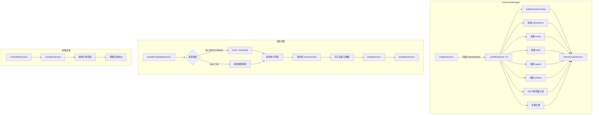

# extension-manager.ts

> 扩展系统的核心管理器，负责扩展的完整生命周期：安装、卸载、更新、加载、启用/禁用及重启。

## 概述

`extension-manager.ts`（约 1310 行）是 Gemini CLI 扩展系统的实际实现，继承自 `@google/gemini-cli-core` 的 `ExtensionLoader` 抽象类。`ExtensionManager` 类管理着扩展的完整生命周期：

- **安装**：支持本地路径、git 仓库克隆、GitHub Release 下载三种来源，安装前会校验安全策略（`allowedExtensions`、`blockGitExtensions`）、请求用户同意、处理工作区信任。
- **卸载**：移除扩展文件、清理启用状态、记录遥测事件。
- **更新**：实质是"卸载旧版 + 安装新版"的原子操作，保留用户设置和启用状态。
- **加载**：从磁盘扫描 `~/.gemini/extensions/` 下的所有子目录，逐个构建 `GeminiCLIExtension` 对象（包括 MCP 服务器配置、上下文文件、Hooks、Skills、Agents、策略规则、主题等）。
- **启用/禁用**：支持 User / Workspace / Session 三种作用域，自动启停扩展的 MCP 服务器。

## 架构图（mermaid）

## 主要导出

| 导出名称 | 类型 | 说明 |
|---------|------|------|
| `ExtensionManager` | `class extends ExtensionLoader` | 扩展管理器核心类 |
| `copyExtension` | `(source: string, destination: string) => Promise<void>` | 递归复制扩展目录 |
| `inferInstallMetadata` | `(source: string, args?) => Promise<ExtensionInstallMetadata>` | 根据来源字符串推断安装类型（git / local） |
| `getExtensionId` | `(config: ExtensionConfig, installMetadata?) => string` | 计算扩展的唯一 ID（基于来源的 SHA-256 哈希） |
| `hashValue` | `(value: string) => string` | SHA-256 哈希工具函数 |

## 核心逻辑

### ExtensionManager 类

**构造函数参数**（`ExtensionManagerParams`）：
- `settings`: 合并后的设置
- `requestConsent`: 用户同意回调
- `requestSetting`: 设置值交互式提示回调
- `workspaceDir`: 工作区目录
- `enabledExtensionOverrides`: CLI `--extensions` 参数覆盖
- `eventEmitter`: 核心事件发射器
- `clientVersion`: 客户端版本号

**关键方法**：

| 方法 | 说明 |
|------|------|
| `loadExtensions()` | 扫描并加载所有已安装扩展，只调用一次，内含去重和并发保护 |
| `loadExtension(extensionDir)` | 加载单个扩展并添加到列表 |
| `installOrUpdateExtension(metadata, prevConfig?)` | 安装或更新扩展，包含安全校验、同意请求、文件操作、遥测记录 |
| `uninstallExtension(identifier, isUpdate)` | 卸载扩展，`isUpdate=true` 时跳过启用状态清理 |
| `enableExtension(name, scope)` | 启用扩展并启动其服务 |
| `disableExtension(name, scope)` | 禁用扩展并停止其服务 |
| `restartExtension(extension)` | 卸载后重新加载扩展 |
| `loadExtensionConfig(extensionDir)` | 读取并验证 `gemini-extension.json` 配置文件 |
| `toOutputString(extension)` | 格式化扩展信息为可显示的字符串 |

### _buildExtension（私有核心方法）

构建单个扩展的完整数据结构：
1. 校验 `allowedExtensions` 安全策略和 `blockGitExtensions`。
2. 处理 `link` 类型的符号链接路径。
3. 加载扩展配置并解析用户/工作区级别的自定义环境变量（extension settings）。
4. 应用管理员 MCP 白名单，过滤 `trust` 字段。
5. 加载上下文文件、hooks、skills、agents、策略规则。
6. 注册扩展主题到 `themeManager`。
7. 返回完整的 `GeminiCLIExtension` 对象。

### 安装流程关键步骤

1. 校验 `allowedExtensions` 正则白名单或 `blockGitExtensions`。
2. 检查工作区信任，必要时请求用户信任。
3. 根据来源类型执行 `cloneFromGit` 或 `downloadFromGitHubRelease`。
4. 请求用户同意（MCP 服务器、hooks、skills 变更）。
5. 处理名称冲突和目录存在性检查。
6. 保留旧扩展的设置和启用状态（更新场景）。
7. 复制文件、写入安装元数据、加载扩展、启用扩展。
8. 记录安装/更新遥测事件。

### 辅助内部函数

- `filterMcpConfig`: 移除 MCP 配置中的 `trust` 字段并冻结。
- `getContextFileNames`: 解析上下文文件名（默认 `GEMINI.md`）。
- `validateName`: 校验扩展名仅包含字母、数字、短横线。

## 内部依赖

| 模块 | 导入内容 | 用途 |
|------|---------|------|
| `./extension.js` | `loadInstallMetadata`, `ExtensionConfig` | 安装元数据加载与配置类型 |
| `./settings.js` | `MergedSettings`, `SettingScope` | 设置类型与作用域枚举 |
| `./trustedFolders.js` | `isWorkspaceTrusted`, `loadTrustedFolders`, `TrustLevel` | 工作区信任检查与设置 |
| `./extensions/github.js` | `cloneFromGit`, `downloadFromGitHubRelease`, `tryParseGithubUrl` | Git/GitHub 下载 |
| `./extensions/consent.js` | `maybeRequestConsentOrFail` | 用户同意请求 |
| `./extensions/storage.js` | `ExtensionStorage` | 扩展存储目录管理 |
| `./extensions/variables.js` | `EXTENSIONS_CONFIG_FILENAME`, `INSTALL_METADATA_FILENAME`, `recursivelyHydrateStrings` | 配置文件名与变量替换 |
| `./extensions/extensionSettings.js` | 设置加载/提示相关函数 | 扩展自定义设置处理 |
| `./extensions/extensionEnablement.js` | `ExtensionEnablementManager` | 扩展启用/禁用状态管理 |
| `../utils/envVarResolver.js` | `resolveEnvVarsInObject` | 环境变量解析 |
| `../ui/themes/theme-manager.js` | `themeManager` | 主题注册与注销 |
| `../commands/extensions/utils.js` | `getFormattedSettingValue` | 设置值格式化显示 |

## 外部依赖

| 模块 | 导入内容 | 用途 |
|------|---------|------|
| `@google/gemini-cli-core` | `Config`, `ExtensionLoader`, `GeminiCLIExtension`, `debugLogger`, `coreEvents`, `applyAdminAllowlist` 等 | 核心类型、日志、事件、扩展遥测 |
| `node:fs` | `fs` | 文件系统操作 |
| `node:path` | `path` | 路径操作 |
| `node:crypto` | `createHash`, `randomUUID` | 哈希计算与唯一标识生成 |
| `node:stream` | `EventEmitter` | 事件发射器类型 |
| `chalk` | `chalk` | 终端颜色输出 |
