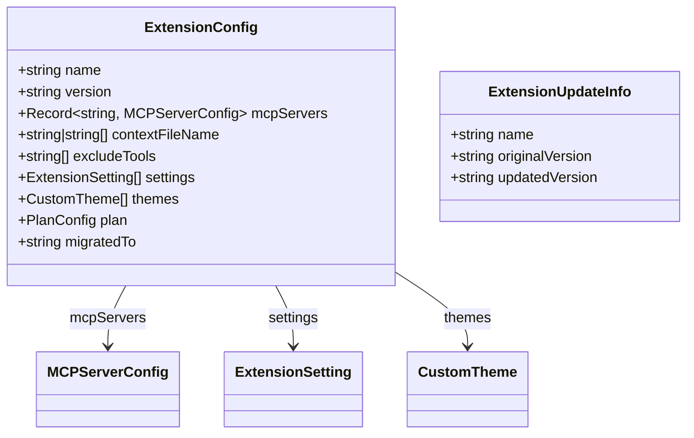

# extension.ts

> 定义扩展配置文件（`gemini-extension.json`）的数据结构，并提供安装元数据的加载功能。

## 概述

`extension.ts` 是扩展系统的基础类型定义模块。它定义了扩展磁盘配置文件 `gemini-extension.json` 的 TypeScript 接口 `ExtensionConfig`，以及扩展更新信息 `ExtensionUpdateInfo`。同时提供了 `loadInstallMetadata` 函数，用于从扩展目录中读取安装元数据文件。

本文件明确指出 `ExtensionConfig` 仅限于文件读取逻辑使用，不应在扩展操作（加载、卸载、更新）的外部引用。

## 架构图（mermaid）

## 主要导出

| 导出名称 | 类型 | 说明 |
|---------|------|------|
| `ExtensionConfig` | `interface` | 扩展配置文件的完整结构：名称、版本、MCP 服务器、上下文文件名、排除工具、设置、主题、计划目录、迁移目标 |
| `ExtensionUpdateInfo` | `interface` | 扩展更新信息：名称、原版本、新版本 |
| `loadInstallMetadata` | `(extensionDir: string) => ExtensionInstallMetadata \| undefined` | 从扩展目录读取安装元数据文件，解析失败返回 `undefined` |

## 核心逻辑

### loadInstallMetadata

1. 拼接安装元数据文件路径：`extensionDir + INSTALL_METADATA_FILENAME`。
2. 使用 `fs.readFileSync` 同步读取文件内容。
3. `JSON.parse` 解析为 `ExtensionInstallMetadata` 对象。
4. 读取或解析失败时静默返回 `undefined`。

## 内部依赖

| 模块 | 导入内容 | 用途 |
|------|---------|------|
| `./extensions/variables.js` | `INSTALL_METADATA_FILENAME` | 安装元数据文件名常量 |
| `./extensions/extensionSettings.js` | `ExtensionSetting`（类型） | 扩展设置定义类型 |

## 外部依赖

| 模块 | 导入内容 | 用途 |
|------|---------|------|
| `@google/gemini-cli-core` | `MCPServerConfig`, `ExtensionInstallMetadata`, `CustomTheme` | 核心类型定义 |
| `node:fs` | `fs` | 文件系统读取 |
| `node:path` | `path` | 路径拼接 |
