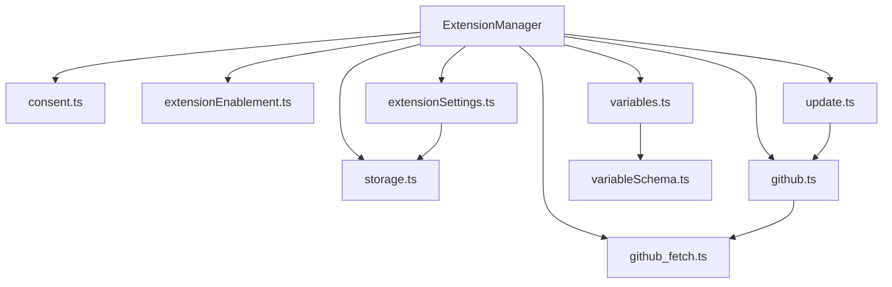

# config/extensions 架构

> 扩展系统的底层配置模块，处理扩展的存储、同意流程、启用管理、设置、GitHub 操作、更新和变量替换。

## 概述

`config/extensions/` 目录提供了扩展系统的底层基础设施。它不直接处理用户命令，而是为 `ExtensionManager` 和各种扩展命令提供核心服务：管理扩展文件存储路径、处理安装同意流程、控制扩展启用/禁用状态（基于文件路径覆盖规则）、管理扩展设置（包括敏感信息的 keychain 存储）、与 GitHub 交互获取扩展代码、执行更新检查，以及变量替换系统。

## 架构图



## 目录结构

```
extensions/
├── storage.ts               # 扩展文件存储路径管理
├── consent.ts               # 安装同意和安全警告
├── extensionEnablement.ts   # 扩展启用/禁用状态管理
├── extensionSettings.ts     # 扩展设置管理（env 文件 + keychain）
├── github.ts                # GitHub 仓库操作（克隆、release 下载、更新检查）
├── github_fetch.ts          # GitHub API HTTP 请求工具
├── update.ts                # 扩展更新流程
├── variables.ts             # 变量替换系统（JSON 对象递归水合）
└── variableSchema.ts        # 变量 Schema 定义
```

## 关键文件

| 文件 | 功能 |
|------|------|
| `storage.ts` | `ExtensionStorage` 类：管理扩展的安装目录路径（`~/.gemini/extensions/<name>/`）、配置文件路径、env 文件路径，提供临时目录创建 |
| `consent.ts` | 扩展安装的安全同意流程：`INSTALL_WARNING_MESSAGE` 安全警告文本、`skillsConsentString()` 技能安装同意文本、`requestConsentNonInteractive()` 非交互式同意确认 |
| `extensionEnablement.ts` | `Override` 类实现基于路径的启用/禁用规则，支持精确匹配和子目录通配；`AllExtensionsEnablementConfig` 管理所有扩展的启用配置 |
| `extensionSettings.ts` | 扩展设置管理：`ExtensionSettingScope`（USER/WORKSPACE）、`promptForSetting()` 交互式设置输入、`updateSetting()` 更新设置值（普通值存 .env，敏感值存 keychain）、`getScopedEnvContents()` 读取指定作用域的设置 |
| `github.ts` | GitHub 操作：`cloneFromGit()` 克隆仓库、`checkForExtensionUpdate()` 检查更新、GitHub release 资产下载和解压（支持 tar/zip） |
| `github_fetch.ts` | `fetchJson()` HTTP 请求工具，支持 GITHUB_TOKEN 认证和重定向跟随 |
| `update.ts` | `updateExtension()` 执行扩展更新流程，协调状态管理、版本检查和文件复制 |
| `variables.ts` | 变量替换系统：`recursivelyHydrateStrings()` 递归替换 JSON 对象中的 `${var}` 占位符、`validateVariables()` 验证必需变量 |
| `variableSchema.ts` | 定义可用变量 Schema：`extensionPath`、`workspacePath`、`pathSeparator` 等 |

## 内部依赖

- `../extension.ts` - 扩展配置类型
- `../extension-manager.ts` - ExtensionManager
- `../../ui/state/extensions.ts` - 扩展更新状态类型

## 外部依赖

| 依赖 | 用途 |
|------|------|
| `@google/gemini-cli-core` | Storage、homedir、KeychainTokenStorage、debugLogger |
| `simple-git` | Git 克隆操作 |
| `tar` | tar 包解压 |
| `extract-zip` | zip 文件解压 |
| `dotenv` | .env 文件解析 |
| `prompts` | 交互式用户输入 |
| `node:https` | HTTPS 请求 |
