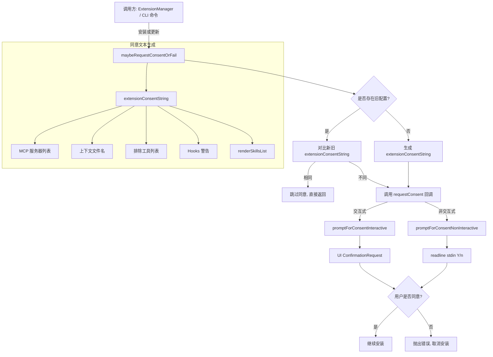

# consent.ts

> 扩展安装与更新过程中的用户同意（consent）交互管理模块。

## 概述

`consent.ts` 负责在安装或更新 Gemini CLI 扩展时，向用户展示安全警告信息并获取用户的明确同意。该模块支持两种交互模式：交互式（interactive，在 CLI UI 中弹出确认请求）和非交互式（non-interactive，通过 stdin 读取 Y/n 输入）。它还会根据扩展配置（MCP 服务器、上下文文件、Hooks、Agent Skills 等）生成详细的同意描述文本，确保用户在安装前充分了解扩展的行为和权限。

## 架构图（mermaid）

## 主要导出

| 导出名称 | 类型 | 说明 |
|---------|------|------|
| `INSTALL_WARNING_MESSAGE` | `string` | 扩展安装的第三方安全警告常量（黄色 chalk 文本） |
| `SKILLS_WARNING_MESSAGE` | `string` | Agent Skills 注入系统提示的安全警告常量（黄色 chalk 文本） |
| `skillsConsentString` | `async function` | 为安装 Agent Skills 生成同意描述文本 |
| `requestConsentNonInteractive` | `async function` | 非交互模式下通过 stdin 请求用户同意 |
| `requestConsentInteractive` | `async function` | 交互模式下通过 UI 确认请求获取用户同意 |
| `promptForConsentNonInteractive` | `async function` | 底层非交互式 Y/n 提示函数 |
| `maybeRequestConsentOrFail` | `async function` | 核心入口：比较新旧配置差异，仅在必要时请求同意，否则抛出异常取消安装 |

## 核心逻辑

1. **`extensionConsentString`**（内部函数）：根据 `ExtensionConfig` 的各字段（`mcpServers`、`contextFileName`、`excludeTools`、hooks、skills）以及迁移/重命名状态，拼接出完整的同意描述文本。所有输入先通过 `escapeAnsiCtrlCodes` 进行 ANSI 控制码转义以防注入。

2. **`renderSkillsList`**（内部函数）：格式化 Agent Skills 列表，包括技能名称、描述、源路径以及目录中的文件数量统计。

3. **`maybeRequestConsentOrFail`**：核心流程控制函数。当存在旧配置时，同时生成新旧两份同意文本进行比较——若完全相同则静默跳过；否则调用传入的 `requestConsent` 回调函数请求用户确认。用户拒绝时抛出 `Error`。

4. **两种提示模式**：
   - `promptForConsentNonInteractive`：使用 Node.js `readline` 模块从 stdin 读取输入，默认值为 `true`（直接回车即同意）。
   - `promptForConsentInteractive`：通过回调函数将 `ConfirmationRequest` 对象传递给 UI 层，由 UI 渲染确认对话框并通过 `onConfirm` 回调返回结果。

## 内部依赖

| 模块路径 | 用途 |
|---------|------|
| `../../ui/types.js` | `ConfirmationRequest` 类型定义 |
| `../../ui/utils/textUtils.js` | `escapeAnsiCtrlCodes` 函数，防止 ANSI 注入 |
| `../extension.js` | `ExtensionConfig` 类型定义 |

## 外部依赖

| 包名 | 用途 |
|------|------|
| `node:fs/promises` | 读取技能目录文件列表 |
| `node:path` | 路径解析（获取技能所在目录） |
| `@google/gemini-cli-core` | `debugLogger` 日志工具、`SkillDefinition` 类型 |
| `chalk` | 终端文本着色（警告信息使用黄色） |
