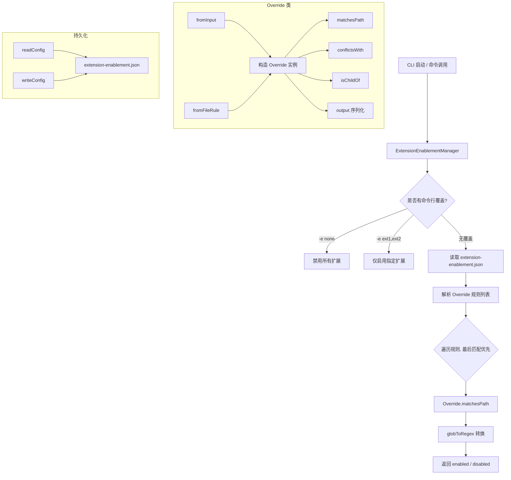

# extensionEnablement.ts

> 基于路径规则的扩展启用/禁用状态管理模块。

## 概述

`extensionEnablement.ts` 实现了 Gemini CLI 扩展的细粒度启用控制系统。它允许用户按目录路径来启用或禁用特定扩展，支持通配符子目录匹配。该模块通过 JSON 配置文件 (`extension-enablement.json`) 持久化存储覆盖规则，并支持通过命令行参数 (`-e`) 全局覆盖。规则采用"最后匹配优先"策略，即配置列表中最后一个匹配当前路径的规则决定最终启用状态。

## 架构图（mermaid）

## 主要导出

| 导出名称 | 类型 | 说明 |
|---------|------|------|
| `ExtensionEnablementConfig` | `interface` | 单个扩展的启用配置，包含 `overrides: string[]` |
| `AllExtensionsEnablementConfig` | `interface` | 所有扩展的启用配置映射表 |
| `Override` | `class` | 路径覆盖规则类，支持解析、匹配、冲突检测、序列化 |
| `ExtensionEnablementManager` | `class` | 扩展启用状态管理器，核心管理类 |

## 核心逻辑

### Override 类

封装单条路径覆盖规则，包含三个属性：
- **`baseRule`**：规范化后的路径（确保前后都有 `/`）
- **`isDisable`**：是否为禁用规则（以 `!` 前缀表示）
- **`includeSubdirs`**：是否包含子目录（以 `*` 后缀表示）

关键方法：
- `fromInput(inputRule, includeSubdirs)`：从用户输入构造规则（CLI 命令调用）
- `fromFileRule(fileRule)`：从配置文件中的字符串还原规则
- `matchesPath(path)`：通过 `globToRegex` 将 glob 模式转为正则进行路径匹配
- `conflictsWith(other)`：检测两条规则是否冲突（相同 baseRule 但不同行为）
- `isChildOf(parent)`：判断当前规则路径是否为另一个规则的子路径
- `output()`：序列化为配置文件格式的字符串

### ExtensionEnablementManager 类

- **构造函数**：接受可选的 `enabledExtensionNames` 参数（来自 `-e` 命令行选项）
- **`isEnabled(extensionName, currentPath)`**：核心判断方法，优先级为：
  1. 若 `-e none` 则禁用全部
  2. 若 `-e ext1,ext2` 则仅启用列表中的扩展
  3. 否则从配置文件读取规则，按"最后匹配优先"策略判断
- **`enable(name, includeSubdirs, scopePath)`**：添加启用规则，自动清除冲突和子路径规则
- **`disable(name, includeSubdirs, scopePath)`**：添加禁用规则（内部调用 `enable` 并加 `!` 前缀）
- **`remove(extensionName)`**：完全删除某扩展的所有启用配置

### globToRegex 辅助函数

简化的 glob 转正则实现，仅支持 `*` 通配符，将其转换为 `(.*)?` 可选组。

## 内部依赖

| 模块路径 | 用途 |
|---------|------|
| `./storage.js` | `ExtensionStorage` 获取用户扩展目录路径 |

## 外部依赖

| 包名 | 用途 |
|------|------|
| `node:fs` | 同步读写配置文件 |
| `node:path` | 配置文件路径拼接 |
| `@google/gemini-cli-core` | `coreEvents` 错误事件发射、`GeminiCLIExtension` 类型 |
