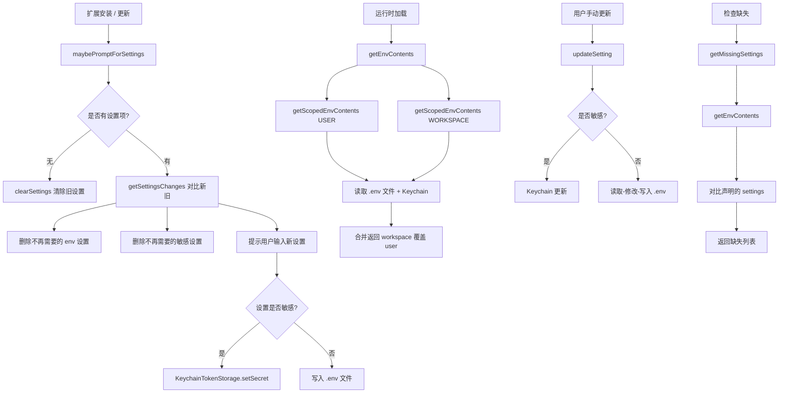

# extensionSettings.ts

> 扩展配置项（settings）的读取、写入、提示和管理模块。

## 概述

`extensionSettings.ts` 管理 Gemini CLI 扩展的用户可配置设置项。每个扩展可以在其 `ExtensionConfig` 中声明一组设置项（如 API 密钥、服务端点等），本模块负责：在安装时提示用户输入这些设置值、将非敏感设置存储到 `.env` 文件中、将敏感设置（如密码、token）存储到系统钥匙串（Keychain）中。支持用户级（user）和工作区级（workspace）两种作用域，工作区设置会覆盖用户设置。

## 架构图（mermaid）

## 主要导出

| 导出名称 | 类型 | 说明 |
|---------|------|------|
| `ExtensionSettingScope` | `enum` | 设置作用域：`USER` / `WORKSPACE` |
| `ExtensionSetting` | `interface` | 单个设置项定义（name, description, envVar, sensitive?） |
| `getEnvFilePath` | `function` | 根据扩展名和作用域获取 `.env` 文件路径 |
| `maybePromptForSettings` | `async function` | 安装/更新时根据设置差异提示用户输入 |
| `promptForSetting` | `async function` | 使用 `prompts` 库提示用户输入单个设置值 |
| `getScopedEnvContents` | `async function` | 读取指定作用域下的所有设置值（env + keychain） |
| `getEnvContents` | `async function` | 合并 user + workspace 作用域的设置值 |
| `updateSetting` | `async function` | 更新单个设置项的值 |
| `getMissingSettings` | `async function` | 获取尚未配置的设置项列表 |

## 核心逻辑

### 设置变更检测 (`getSettingsChanges`)

内部函数，通过对比新旧 `ExtensionSetting[]` 数组，按 `envVar` 和 `sensitive` 属性分类计算出四类变更：
- `promptForSensitive`：新增的敏感设置（需提示用户输入并存入 Keychain）
- `removeSensitive`：被移除的敏感设置（需从 Keychain 删除）
- `promptForEnv`：新增的普通设置（需提示用户输入并写入 `.env`）
- `removeEnv`：被移除的普通设置（需从 `.env` 中移除）

### 双重存储机制

- **非敏感设置**：以 `.env` 文件格式存储，使用 `dotenv` 库解析。写入时对包含空格的值加双引号转义。
- **敏感设置**：使用 `KeychainTokenStorage`（系统钥匙串）加密存储。Keychain 的存储名称由扩展名、扩展 ID、作用域和可选的工作区目录组合而成。

### 作用域合并策略

`getEnvContents` 先读取 USER 级别设置，再读取 WORKSPACE 级别设置，通过展开运算符 `{ ...userSettings, ...workspaceSettings }` 实现工作区设置覆盖用户设置。

### 环境变量安全校验

`formatEnvContent` 对 key 进行正则校验（`/^[a-zA-Z_][a-zA-Z0-9_]*$/`），拒绝非法变量名；对 value 拒绝包含换行符的内容。

## 内部依赖

| 模块路径 | 用途 |
|---------|------|
| `./storage.js` | `ExtensionStorage` 获取扩展 `.env` 文件路径 |
| `../extension.js` | `ExtensionConfig` 类型定义 |
| `./variables.js` | `EXTENSION_SETTINGS_FILENAME` 常量 |

## 外部依赖

| 包名 | 用途 |
|------|------|
| `node:fs/promises` | 异步文件写入 |
| `node:fs` | 同步文件存在性检查和读取 |
| `node:path` | 路径拼接 |
| `dotenv` | `.env` 文件解析 |
| `prompts` | 交互式命令行提示（支持 password 类型隐藏输入） |
| `@google/gemini-cli-core` | `debugLogger` 日志、`KeychainTokenStorage` 钥匙串存储 |
