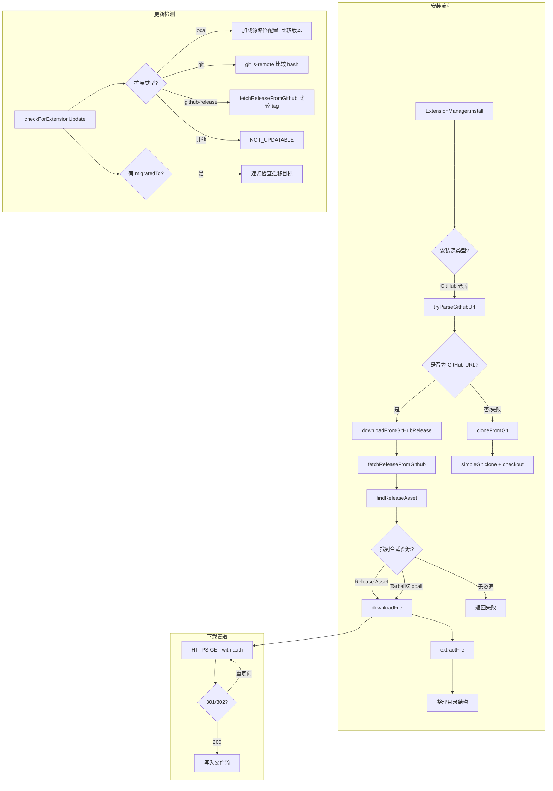

# github.ts

> GitHub 仓库交互模块：Git 克隆、Release 下载、更新检测与资源提取。

## 概述

`github.ts` 是扩展安装和更新流程中与 GitHub 交互的核心模块。它提供了三大功能：(1) 通过 Git 克隆仓库到本地；(2) 从 GitHub Release 下载并解压扩展包（支持 tar.gz 和 zip 格式）；(3) 检测已安装扩展是否有可用更新。该模块支持 GitHub Token 认证、SSH/HTTPS URL 解析、平台特定的 Release 资源匹配（按 OS 和架构），以及本地扩展、Git 仓库扩展和 GitHub Release 扩展三种类型的更新检测策略。

## 架构图（mermaid）

## 主要导出

| 导出名称 | 类型 | 说明 |
|---------|------|------|
| `cloneFromGit` | `async function` | 使用 `simple-git` 浅克隆仓库并切换到指定 ref |
| `GithubRepoInfo` | `interface` | GitHub 仓库信息：`{ owner, repo }` |
| `tryParseGithubUrl` | `function` | 解析 GitHub URL（支持 HTTPS、SSH、org/repo 简写）为 owner/repo |
| `fetchReleaseFromGithub` | `async function` | 从 GitHub API 获取指定 Release 数据 |
| `checkForExtensionUpdate` | `async function` | 检测扩展是否有可用更新，返回 `ExtensionUpdateState` |
| `GitHubDownloadResult` | `type` | 下载结果联合类型（成功/失败及详细原因） |
| `downloadFromGitHubRelease` | `async function` | 从 GitHub Release 下载并解压扩展到目标目录 |
| `findReleaseAsset` | `function` | 按平台和架构匹配最佳 Release 资源 |
| `DownloadOptions` | `interface` | 下载选项（自定义 headers） |
| `downloadFile` | `async function` | HTTPS 文件下载（支持重定向、Token 认证） |
| `extractFile` | `async function` | 解压 tar.gz 或 zip 文件 |

## 核心逻辑

### Git 克隆 (`cloneFromGit`)

1. 使用 `simple-git` 进行 `--depth 1` 浅克隆
2. 若环境中有 `GITHUB_TOKEN`，自动注入到 HTTPS URL 的 username 字段
3. 克隆后 `fetch` 指定的 ref（默认 `HEAD`），然后 `checkout FETCH_HEAD`（分离 HEAD 状态）

### GitHub URL 解析 (`tryParseGithubUrl`)

支持多种格式：
- `git@github.com:owner/repo` (SSH)
- `https://github.com/owner/repo` (HTTPS)
- `owner/repo` (简写，自动补全为 github.com)
- 非 GitHub 主机返回 `null`，格式不合法抛出 `TypeError`/`Error`

### Release 资源匹配 (`findReleaseAsset`)

优先级：
1. `{platform}.{arch}.xxx` - 平台+架构精确匹配
2. `{platform}.xxx` - 仅平台匹配
3. 唯一通用资源（不含任何平台关键词且只有一个资源时）

### Release 下载 (`downloadFromGitHubRelease`)

1. 获取 Release 数据，查找匹配的资源
2. 若无 asset，回退到 tarball_url / zipball_url
3. 下载文件（二进制资源用 `application/octet-stream`，tarball 用 `application/vnd.github+json`）
4. 解压后检测目录结构：若只有一个子目录且包含 `gemini-extension.json`，则将内容提升到上层目录
5. 清理下载的压缩包

### 更新检测 (`checkForExtensionUpdate`)

三种策略：
- **local**: 重新加载源路径的配置，比较 `version` 字段
- **git**: 执行 `git ls-remote` 获取远程 HEAD hash，与本地 `HEAD` hash 比较
- **github-release**: 获取最新 Release 的 `tag_name`，与已安装的 `releaseTag` 比较
- 支持 `migratedTo` 迁移检测：递归检查迁移目标仓库

## 内部依赖

| 模块路径 | 用途 |
|---------|------|
| `./github_fetch.js` | `fetchJson`、`getGitHubToken` 网络请求工具 |
| `../extension.js` | `ExtensionConfig` 类型 |
| `../extension-manager.js` | `ExtensionManager` 类型 |
| `./variables.js` | `EXTENSIONS_CONFIG_FILENAME` 常量 |
| `../../ui/state/extensions.js` | `ExtensionUpdateState` 枚举 |

## 外部依赖

| 包名 | 用途 |
|------|------|
| `simple-git` | Git 操作（clone, fetch, checkout, ls-remote, revparse） |
| `@google/gemini-cli-core` | `debugLogger`、`getErrorMessage`、`ExtensionInstallMetadata`、`GeminiCLIExtension` |
| `node:os` | 获取 `platform()` 和 `arch()` 用于资源匹配 |
| `node:https` | HTTPS 文件下载 |
| `node:fs` | 文件系统操作（目录读取、文件删除、流写入） |
| `node:path` | 路径拼接 |
| `tar` | tar.gz 解压 |
| `extract-zip` | zip 解压 |
