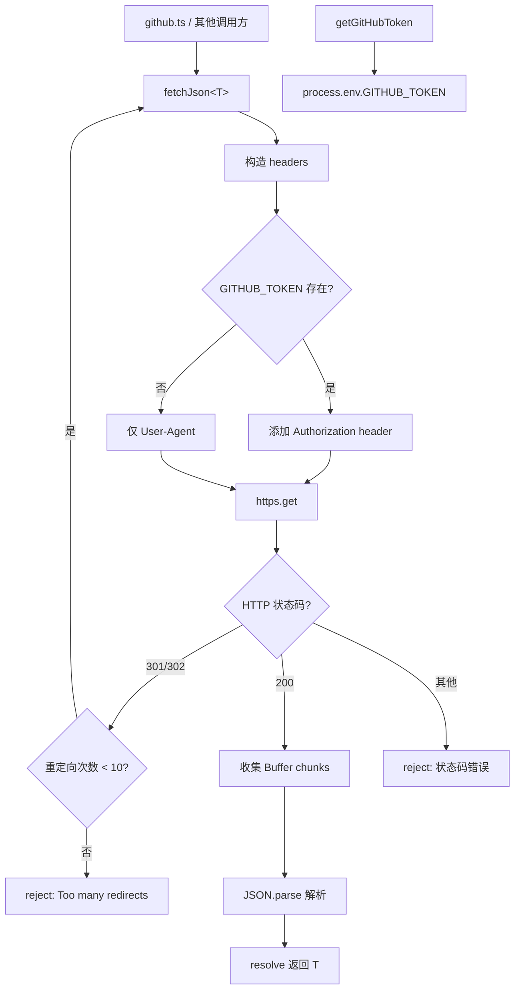

# github_fetch.ts

> 对 GitHub API 进行 HTTPS JSON 请求的轻量级工具模块。

## 概述

`github_fetch.ts` 提供了两个简洁的工具函数：一个用于获取 GitHub Token 环境变量，另一个用于发起带认证和重定向处理的 HTTPS JSON 请求。该模块是 `github.ts` 的底层网络依赖，被用于获取 GitHub Release 数据等 API 调用场景。

## 架构图（mermaid）

## 主要导出

| 导出名称 | 类型 | 说明 |
|---------|------|------|
| `getGitHubToken` | `function` | 从环境变量 `GITHUB_TOKEN` 获取 GitHub 访问令牌 |
| `fetchJson<T>` | `async function` | 通用的 GitHub API JSON 请求函数，支持泛型类型参数 |

## 核心逻辑

### `getGitHubToken()`

简单地返回 `process.env['GITHUB_TOKEN']`。若未设置则返回 `undefined`。被 `github.ts` 中的 `cloneFromGit` 和 `downloadFile` 同时使用。

### `fetchJson<T>(url, redirectCount?)`

基于 Node.js 原生 `https.get` 实现的 JSON 请求函数：

1. **认证**：自动检测 `GITHUB_TOKEN`，存在时添加 `Authorization: token xxx` 请求头
2. **User-Agent**：始终发送 `User-Agent: gemini-cli`（GitHub API 要求）
3. **重定向处理**：支持 301/302 重定向，最多跟随 10 次（超过则拒绝）
4. **数据收集**：通过监听 `data` 事件将 `Buffer` 块收集到数组中，在 `end` 事件时合并并 `JSON.parse`
5. **类型安全**：使用泛型参数 `T` 允许调用方指定返回类型（如 `fetchJson<GithubReleaseData[]>(url)`）

注意：该函数不依赖任何第三方 HTTP 库（如 axios、node-fetch），完全使用 Node.js 内置的 `https` 模块。

## 内部依赖

无。

## 外部依赖

| 包名 | 用途 |
|------|------|
| `node:https` | HTTPS GET 请求 |
