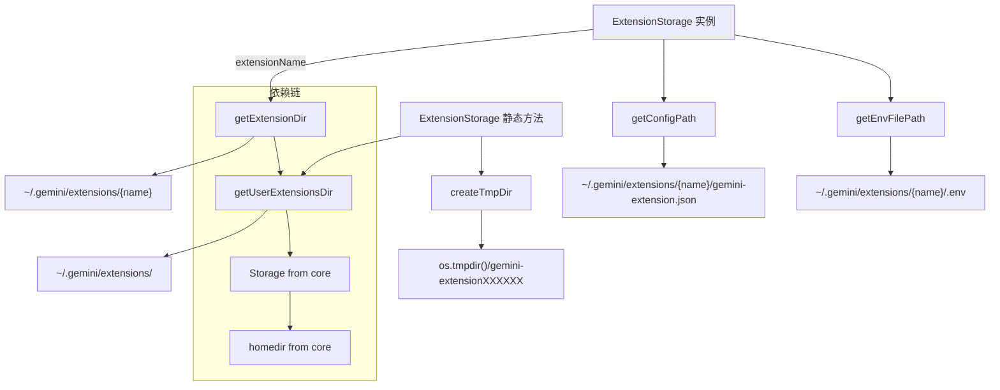

# storage.ts

> 扩展文件存储路径管理工具类。

## 概述

`storage.ts` 提供了 `ExtensionStorage` 类，封装了与单个扩展相关的所有文件系统路径计算逻辑。它负责确定扩展的安装目录、配置文件路径、环境变量文件路径，以及提供用户级扩展根目录和临时目录的创建能力。该类是扩展系统中各模块获取路径信息的统一入口。

## 架构图（mermaid）



## 主要导出

| 导出名称 | 类型 | 说明 |
|---------|------|------|
| `ExtensionStorage` | `class` | 扩展存储路径管理类 |

## 核心逻辑

### ExtensionStorage 类

#### 构造函数

接受 `extensionName: string` 参数，保存为私有只读属性。

#### 实例方法

| 方法 | 返回值 | 说明 |
|------|--------|------|
| `getExtensionDir()` | `string` | 返回扩展安装目录：`{userExtensionsDir}/{extensionName}` |
| `getConfigPath()` | `string` | 返回扩展配置文件路径：`{extensionDir}/gemini-extension.json` |
| `getEnvFilePath()` | `string` | 返回扩展环境变量文件路径：`{extensionDir}/.env` |

#### 静态方法

| 方法 | 返回值 | 说明 |
|------|--------|------|
| `getUserExtensionsDir()` | `string` | 返回用户级扩展根目录，通过 `Storage(homedir()).getExtensionsDir()` 获取 |
| `createTmpDir()` | `Promise<string>` | 在系统临时目录下创建以 `gemini-extension` 为前缀的唯一临时目录 |

### 路径结构

```
~/ (homedir)
  .gemini/
    extensions/                           # getUserExtensionsDir()
      {extensionName}/                    # getExtensionDir()
        gemini-extension.json             # getConfigPath()
        .env                              # getEnvFilePath()
```

`createTmpDir()` 创建的临时目录位于系统临时路径下（如 `/tmp/gemini-extensionABCDEF`），用于安装过程中的中间文件存储。

## 内部依赖

| 模块路径 | 用途 |
|---------|------|
| `./variables.js` | `EXTENSION_SETTINGS_FILENAME`（`.env`）、`EXTENSIONS_CONFIG_FILENAME`（`gemini-extension.json`）常量 |

## 外部依赖

| 包名 | 用途 |
|------|------|
| `node:path` | 路径拼接 |
| `node:fs` | `fs.promises.mkdtemp` 创建临时目录 |
| `node:os` | `os.tmpdir()` 获取系统临时目录 |
| `@google/gemini-cli-core` | `Storage` 类获取全局扩展目录、`homedir` 函数获取用户主目录 |
