# update.ts

> 扩展更新执行与批量更新检测调度模块。

## 概述

`update.ts` 负责扩展更新的实际执行流程和批量更新检测的调度。它提供了三个核心功能：(1) 更新单个扩展（包含状态分发、临时备份和回滚机制）；(2) 批量更新所有可更新的扩展；(3) 并发检测所有已安装扩展的更新状态。该模块与 UI 状态管理层通过 `dispatch` 函数解耦，确保更新过程中 UI 能实时反映每个扩展的状态变化。

## 架构图（mermaid）

```mermaid
flowchart TD
    subgraph 单个扩展更新
        A[updateExtension] --> B{当前状态是否为 UPDATING?}
        B -->|是| C[返回 undefined, 避免重复更新]
        B -->|否| D[dispatch: SET_STATE UPDATING]
        D --> E[loadInstallMetadata]
        E --> F{安装类型?}
        F -->|link| G[抛出错误: 链接扩展无需更新]
        F -->|无类型| H[抛出错误: 类型未知]
        F -->|git/github-release/local| I{有 migratedTo?}
        I -->|是| J[checkForExtensionUpdate 迁移目标]
        J --> K[更新 source 为迁移目标]
        I -->|否| L[创建临时备份目录]
        K --> L
        L --> M[extensionManager.installOrUpdateExtension]
        M -->|成功| N[dispatch: UPDATED / UPDATED_NEEDS_RESTART]
        M -->|失败| O[copyExtension 回滚]
        O --> P[dispatch: ERROR]
        N --> Q[返回 ExtensionUpdateInfo]
        L -.->|finally| R[清理临时目录]
    end

    subgraph 批量更新
        S[updateAllUpdatableExtensions] --> T[过滤 UPDATE_AVAILABLE 扩展]
        T --> U[Promise.all 并发 updateExtension]
        U --> V[过滤有效结果]
    end

    subgraph 批量检测
        W[checkForAllExtensionUpdates] --> X[dispatch: BATCH_CHECK_START]
        X --> Y[遍历所有扩展]
        Y --> Z{有 installMetadata?}
        Z -->|否| AA[dispatch: NOT_UPDATABLE]
        Z -->|是| AB[dispatch: CHECKING_FOR_UPDATES]
        AB --> AC[checkForExtensionUpdate]
        AC --> AD[dispatch: 检测结果状态]
        AD --> AE[Promise.all 等待所有完成]
        AE --> AF[dispatch: BATCH_CHECK_END]
    end
```

## 主要导出

| 导出名称 | 类型 | 说明 |
|---------|------|------|
| `ExtensionUpdateInfo` | `interface` | 更新结果信息：`{ name, originalVersion, updatedVersion }` |
| `updateExtension` | `async function` | 更新单个扩展，含备份和回滚机制 |
| `updateAllUpdatableExtensions` | `async function` | 并发更新所有状态为 `UPDATE_AVAILABLE` 的扩展 |
| `ExtensionUpdateCheckResult` | `interface` | 更新检测结果：`{ state, error? }` |
| `checkForAllExtensionUpdates` | `async function` | 并发检测所有扩展的更新状态 |

## 核心逻辑

### `updateExtension` - 单扩展更新

1. **防重入检查**：若当前状态已为 `UPDATING` 则直接返回
2. **状态分发**：通过 `dispatchExtensionStateUpdate` 通知 UI 当前进度
3. **迁移检测**：若扩展声明了 `migratedTo`，先检查迁移目标是否有可用更新，若有则更新 `installMetadata.source`
4. **临时备份**：调用 `ExtensionStorage.createTmpDir()` 创建备份目录
5. **执行安装**：调用 `extensionManager.installOrUpdateExtension` 执行实际更新
6. **回滚机制**：若更新失败，使用 `copyExtension` 将备份恢复到原路径
7. **热重载支持**：根据 `enableExtensionReloading` 参数决定状态为 `UPDATED`（可热重载）或 `UPDATED_NEEDS_RESTART`（需重启）
8. **清理**：`finally` 块中删除临时目录

### `updateAllUpdatableExtensions` - 批量更新

从扩展状态映射中筛选 `UPDATE_AVAILABLE` 的扩展，使用 `Promise.all` 并发执行更新，过滤掉 `undefined` 结果返回有效的更新信息列表。

### `checkForAllExtensionUpdates` - 批量检测

1. 分发 `BATCH_CHECK_START` 事件
2. 遍历所有扩展：无 `installMetadata` 的标记为 `NOT_UPDATABLE`，其余标记为 `CHECKING_FOR_UPDATES` 后调用 `checkForExtensionUpdate`
3. 使用 `Promise.all` 等待所有检测完成
4. `finally` 块中分发 `BATCH_CHECK_END` 事件

## 内部依赖

| 模块路径 | 用途 |
|---------|------|
| `../../ui/state/extensions.js` | `ExtensionUpdateAction`、`ExtensionUpdateState`、`ExtensionUpdateStatus` 类型/枚举 |
| `../extension.js` | `loadInstallMetadata` 函数 |
| `./github.js` | `checkForExtensionUpdate` 更新检测函数 |
| `../extension-manager.js` | `copyExtension` 回滚函数、`ExtensionManager` 类型 |
| `./storage.js` | `ExtensionStorage.createTmpDir` 临时目录创建 |

## 外部依赖

| 包名 | 用途 |
|------|------|
| `@google/gemini-cli-core` | `debugLogger`、`getErrorMessage`、`GeminiCLIExtension` |
| `node:fs` | `fs.promises.rm` 清理临时目录 |
