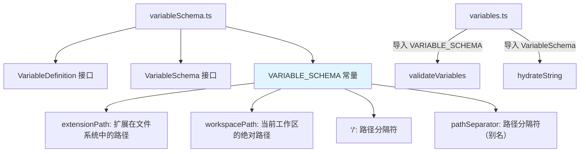

# variableSchema.ts

> 扩展配置模板变量的类型定义与内置变量 schema 声明。

## 概述

`variableSchema.ts` 定义了 Gemini CLI 扩展配置文件中模板变量的类型系统和内置变量 schema。扩展配置中的字符串值可以包含 `${variableName}` 形式的占位符，在加载时会被替换为实际值。本模块声明了这些变量的名称、类型、描述和约束条件，供 `variables.ts` 中的水合（hydrate）逻辑使用。

## 架构图（mermaid）



## 主要导出

| 导出名称 | 类型 | 说明 |
|---------|------|------|
| `VariableDefinition` | `interface` | 单个变量的定义：type, description, default?, required? |
| `VariableSchema` | `interface` | 变量 schema 映射表 `{ [key: string]: VariableDefinition }` |
| `VARIABLE_SCHEMA` | `const object` | 内置变量 schema 常量，包含所有预定义变量 |

## 核心逻辑

### VariableDefinition 接口

| 属性 | 类型 | 说明 |
|------|------|------|
| `type` | `'string'` | 变量类型（当前仅支持字符串） |
| `description` | `string` | 变量的描述说明 |
| `default?` | `string` | 可选的默认值 |
| `required?` | `boolean` | 是否为必填变量 |

### VARIABLE_SCHEMA 内置变量

| 变量名 | 说明 | 示例值 |
|--------|------|--------|
| `extensionPath` | 扩展在文件系统中的安装路径 | `/home/user/.gemini/extensions/my-ext` |
| `workspacePath` | 当前工作区的绝对路径 | `/home/user/my-project` |
| `/` | 路径分隔符 | `/`（POSIX）或 `\`（Windows） |
| `pathSeparator` | 路径分隔符（`/` 的别名） | 同上 |

`/` 和 `pathSeparator` 共享同一个 `PATH_SEPARATOR_DEFINITION` 定义对象，提供两种引用方式以满足不同使用习惯。

### 使用场景示例

扩展配置文件 `gemini-extension.json` 中可使用：
```json
{
  "mcpServers": {
    "my-server": {
      "command": "${extensionPath}${/}bin${/}server"
    }
  }
}
```
加载时 `${extensionPath}` 和 `${/}` 会被替换为实际值。

## 内部依赖

无。

## 外部依赖

无。
