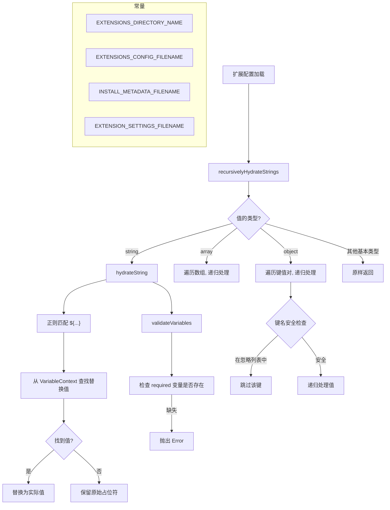

# variables.ts

> 扩展配置常量定义与模板变量水合（hydration）引擎。

## 概述

`variables.ts` 是扩展系统的基础工具模块，提供两方面功能：(1) 定义扩展文件系统中的关键文件名和目录名常量；(2) 实现模板变量的水合引擎，能够递归地将对象树中所有 `${variableName}` 占位符替换为实际值。该模块还包含原型链污染防护机制，在反序列化过程中过滤 `__proto__`、`constructor`、`prototype` 等危险键名。

## 架构图（mermaid）

## 主要导出

| 导出名称 | 类型 | 说明 |
|---------|------|------|
| `EXTENSIONS_DIRECTORY_NAME` | `string` | 扩展目录名：`.gemini/extensions` |
| `EXTENSIONS_CONFIG_FILENAME` | `string` | 扩展配置文件名：`gemini-extension.json` |
| `INSTALL_METADATA_FILENAME` | `string` | 安装元数据文件名：`.gemini-extension-install.json` |
| `EXTENSION_SETTINGS_FILENAME` | `string` | 扩展设置文件名：`.env` |
| `JsonObject` | `type` | JSON 对象类型别名 |
| `JsonArray` | `type` | JSON 数组类型别名 |
| `JsonValue` | `type` | JSON 值联合类型 |
| `VariableContext` | `type` | 变量上下文映射：`{ [key: string]: string \| undefined }` |
| `validateVariables` | `function` | 校验变量上下文是否满足 schema 中的 required 约束 |
| `hydrateString` | `function` | 将单个字符串中的 `${...}` 占位符替换为变量上下文中的实际值 |
| `recursivelyHydrateStrings<T>` | `function` | 递归地对任意嵌套对象树执行模板变量水合 |

## 核心逻辑

### 常量

| 常量 | 值 | 说明 |
|------|-----|------|
| `EXTENSIONS_DIRECTORY_NAME` | `{GEMINI_DIR}/extensions` | 使用 `path.join` 拼接，`GEMINI_DIR` 来自 core 包 |
| `EXTENSIONS_CONFIG_FILENAME` | `gemini-extension.json` | 每个扩展根目录下的配置文件 |
| `INSTALL_METADATA_FILENAME` | `.gemini-extension-install.json` | 记录安装来源和类型的元数据文件 |
| `EXTENSION_SETTINGS_FILENAME` | `.env` | 扩展的非敏感设置存储文件 |

### `validateVariables(variables, schema)`

遍历 schema 中的每个定义，若 `required` 为 `true` 但对应变量在上下文中缺失，则抛出 `Error: Missing required variable: {key}`。

### `hydrateString(str, context)`

1. 先调用 `validateVariables` 校验上下文
2. 使用正则 `/\${(.*?)}/g` 匹配所有 `${...}` 占位符
3. 对每个匹配项，从 `context` 中查找对应值：找到则替换，找不到（`null` 或 `undefined`）则保留原始占位符文本

### `recursivelyHydrateStrings<T>(obj, values)`

递归处理任意类型的对象树：
- **string**：调用 `hydrateString` 替换
- **array**：对每个元素递归处理
- **object**：遍历所有自有属性（通过 `hasOwnProperty` 检查），跳过 `UNMARSHALL_KEY_IGNORE_LIST` 中的危险键（`__proto__`、`constructor`、`prototype`），对值递归处理
- **其他类型**（number、boolean、null）：原样返回

该函数保持泛型 `T` 的类型签名，返回与输入相同结构但字符串已替换的新对象（不修改原对象）。

### 安全防护

`UNMARSHALL_KEY_IGNORE_LIST` 包含 `__proto__`、`constructor`、`prototype` 三个键名。在递归处理对象时，这些键会被静默跳过，防止通过恶意扩展配置进行原型链污染攻击。

## 内部依赖

| 模块路径 | 用途 |
|---------|------|
| `./variableSchema.js` | `VariableSchema` 类型、`VARIABLE_SCHEMA` 内置 schema 常量 |

## 外部依赖

| 包名 | 用途 |
|------|------|
| `node:path` | `path.join` 拼接扩展目录路径 |
| `@google/gemini-cli-core` | `GEMINI_DIR` 常量（`.gemini` 目录名） |
