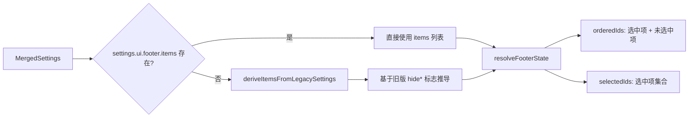

# footerItems.ts

> 定义 CLI 底部状态栏（footer）的所有可选项、默认顺序，并提供基于设置的项目解析逻辑。

## 概述

`footerItems.ts` 管理 CLI 交互界面底部状态栏的配置。它定义了 10 种可选的状态栏项目（工作区、Git 分支、沙箱状态、模型名称、上下文使用率、配额、内存使用、会话 ID、代码变更、token 计数），提供了从旧版设置到新版项目列表的迁移逻辑，以及统一的状态栏解析函数。

## 架构图（mermaid）

## 主要导出

| 导出名称 | 类型 | 说明 |
|---------|------|------|
| `ALL_ITEMS` | `const readonly array` | 所有可选的底部栏项目定义，包含 `id`、`header`、`description` |
| `FooterItemId` | `type` | 底部栏项目 ID 的联合类型 |
| `DEFAULT_ORDER` | `string[]` | 全部项目的默认排列顺序 |
| `deriveItemsFromLegacySettings` | `(settings: MergedSettings) => string[]` | 从旧版 `hide*` 布尔标志推导出启用的项目列表 |
| `resolveFooterState` | `(settings: MergedSettings) => { orderedIds, selectedIds }` | 解析最终的底部栏状态：有序 ID 列表与选中集合 |

## 核心逻辑

### ALL_ITEMS 定义

10 个底部栏项目：

| ID | 表头 | 描述 |
|----|------|------|
| `workspace` | workspace (/directory) | 当前工作目录 |
| `git-branch` | branch | 当前 Git 分支名 |
| `sandbox` | sandbox | 沙箱类型与信任指示 |
| `model-name` | /model | 当前模型标识 |
| `context-used` | context | 上下文窗口使用百分比 |
| `quota` | /stats | 每日限额剩余 |
| `memory-usage` | memory | 应用内存使用 |
| `session-id` | session | 当前会话唯一标识 |
| `code-changes` | diff | 会话中的代码增删行数 |
| `token-count` | tokens | 会话中的总 token 数 |

### deriveItemsFromLegacySettings

从旧版设置的布尔标志反推出项目列表：
- 默认启用：`workspace`、`git-branch`、`sandbox`、`model-name`、`quota`
- `hideCWD` -> 移除 `workspace`
- `hideSandboxStatus` -> 移除 `sandbox`
- `hideModelInfo` -> 移除 `model-name`、`context-used`、`quota`
- `!hideContextPercentage` -> 添加 `context-used`（在 `model-name` 后）
- `showMemoryUsage` -> 添加 `memory-usage`

### resolveFooterState

1. 优先使用 `settings.ui.footer.items`，否则回退到 `deriveItemsFromLegacySettings`。
2. 过滤掉无效 ID。
3. 将未被选中的项目按 `DEFAULT_ORDER` 排在后面。
4. 返回 `orderedIds`（完整顺序）和 `selectedIds`（选中项集合）。

## 内部依赖

| 模块 | 导入内容 | 用途 |
|------|---------|------|
| `./settings.js` | `MergedSettings`（类型） | 合并设置类型 |

## 外部依赖

无。
