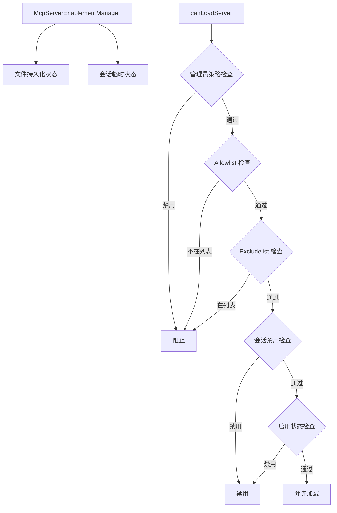

# config/mcp 架构

> MCP 服务器的启用状态管理，控制哪些 MCP 服务器在会话中可用。

## 概述

`config/mcp/` 目录负责 MCP（Model Context Protocol）服务器的启用/禁用状态管理。它提供了一个持久化的启用配置系统，结合会话级别的临时覆盖，以及管理员策略和 allowlist/excludelist 的权限检查，最终决定每个 MCP 服务器是否可以被加载和连接。

## 架构图



## 目录结构

```
mcp/
├── index.ts                  # 导出入口
└── mcpServerEnablement.ts    # MCP 服务器启用管理器
```

## 关键文件

| 文件 | 功能 |
|------|------|
| `index.ts` | 统一导出入口，重导出 `McpServerEnablementManager`、`canLoadServer`、`normalizeServerId`、`isInSettingsList` 及所有接口类型 |
| `mcpServerEnablement.ts` | 核心实现。`McpServerEnablementManager` 单例类：管理持久化的启用/禁用状态（存储在 JSON 文件中）和会话级临时状态；`canLoadServer()` 函数执行多层检查（admin 策略 -> allowlist -> excludelist -> session -> enablement）决定服务器是否可加载；`normalizeServerId()` 标准化服务器 ID（小写+去空格）；定义 `McpServerEnablementState`、`McpServerDisplayState`、`EnablementCallbacks`、`ServerLoadResult` 等接口 |

## 内部依赖

该模块相对独立，被以下模块引用：
- `../extension-manager.ts` - 扩展启用时自动启用关联的 MCP 服务器
- `../../commands/mcp/enableDisable.ts` - CLI 命令
- `../../commands/mcp/list.ts` - 列出服务器状态

## 外部依赖

| 依赖 | 用途 |
|------|------|
| `@google/gemini-cli-core` | Storage（获取配置文件路径）、coreEvents（事件发射） |
| `node:fs/promises` | 异步文件读写 |
| `node:path` | 路径处理 |
