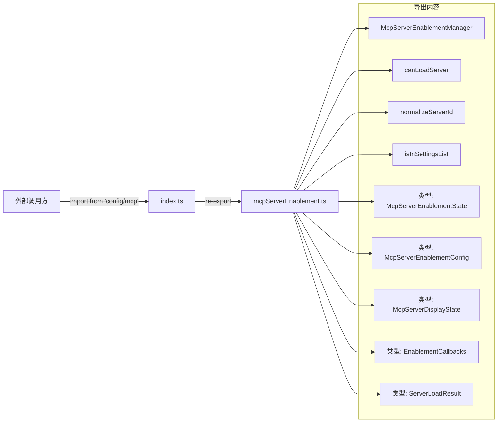

# index.ts

> MCP 服务器启用管理模块的统一导出入口（barrel file）。

## 概述

`index.ts` 是 `mcp/` 目录的入口文件，采用 barrel export 模式将 `mcpServerEnablement.ts` 中的所有公开 API 统一重新导出。其他模块只需从 `config/mcp` 路径导入即可获取所有 MCP 服务器启用管理相关的类、函数和类型，无需了解内部文件结构。

## 架构图（mermaid）

## 主要导出

| 导出名称 | 类型 | 来源 | 说明 |
|---------|------|------|------|
| `McpServerEnablementManager` | `class` | `mcpServerEnablement.ts` | MCP 服务器启用状态管理器（单例） |
| `canLoadServer` | `function` | `mcpServerEnablement.ts` | 判断服务器是否可以加载的统一入口 |
| `normalizeServerId` | `function` | `mcpServerEnablement.ts` | 服务器 ID 标准化（小写+trim） |
| `isInSettingsList` | `function` | `mcpServerEnablement.ts` | 检查服务器 ID 是否在设置列表中 |
| `McpServerEnablementState` | `type` | `mcpServerEnablement.ts` | 持久化启用状态接口 |
| `McpServerEnablementConfig` | `type` | `mcpServerEnablement.ts` | 配置文件格式接口 |
| `McpServerDisplayState` | `type` | `mcpServerEnablement.ts` | UI 显示状态接口 |
| `EnablementCallbacks` | `type` | `mcpServerEnablement.ts` | 启用检查回调接口 |
| `ServerLoadResult` | `type` | `mcpServerEnablement.ts` | 服务器加载结果接口 |

## 核心逻辑

本文件无自身逻辑，纯粹作为 re-export barrel 文件。所有实现细节请参见 `mcpServerEnablement.ts` 的文档。

## 内部依赖

| 模块路径 | 用途 |
|---------|------|
| `./mcpServerEnablement.js` | 所有导出内容的实际来源 |

## 外部依赖

无。
