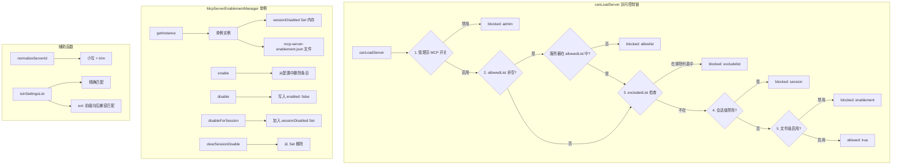

# mcpServerEnablement.ts

> MCP 服务器启用/禁用状态的完整生命周期管理模块。

## 概述

`mcpServerEnablement.ts` 是 MCP（Model Context Protocol）服务器启用控制的核心模块。它实现了多层级的访问控制策略来决定一个 MCP 服务器是否可以被加载，包括：管理员全局开关、允许列表（allowlist）、排除列表（excludelist）、会话级禁用和文件级持久化启用状态。该模块采用单例模式管理状态，支持持久化配置（JSON 文件）和会话级内存状态两种存储方式，并提供面向 UI 的显示状态查询接口。

## 架构图（mermaid）

## 主要导出

| 导出名称 | 类型 | 说明 |
|---------|------|------|
| `McpServerEnablementState` | `interface` | 持久化启用状态：`{ enabled: boolean }` |
| `McpServerEnablementConfig` | `interface` | 配置文件格式：`{ [serverId]: McpServerEnablementState }` |
| `McpServerDisplayState` | `interface` | UI 显示状态：`{ enabled, isSessionDisabled, isPersistentDisabled }` |
| `EnablementCallbacks` | `interface` | 回调接口：`{ isSessionDisabled, isFileEnabled }` |
| `ServerLoadResult` | `interface` | 加载结果：`{ allowed, reason?, blockType? }` |
| `normalizeServerId` | `function` | 服务器 ID 标准化（小写 + trim） |
| `isInSettingsList` | `function` | 检查服务器 ID 是否在设置列表中（含向后兼容） |
| `canLoadServer` | `async function` | 五层访问控制链，判断服务器是否可加载 |
| `McpServerEnablementManager` | `class` | 单例管理器，管理持久化和会话级启用状态 |

## 核心逻辑

### `normalizeServerId(serverId)`

将服务器 ID 转为小写并去除首尾空格，确保所有比较操作大小写不敏感。

### `isInSettingsList(serverId, list)`

两级匹配策略：
1. **精确匹配**：标准化后直接在列表中查找
2. **向后兼容**：若 ID 以 `ext:` 开头，提取冒号后的纯名称进行匹配。匹配成功时返回弃用警告，提示用户更新配置使用完整标识符

### `canLoadServer(serverId, config)` - 五层访问控制

按优先级从高到低执行，首个匹配的规则立即返回：

| 层级 | 检查项 | blockType | 说明 |
|------|--------|-----------|------|
| 1 | `adminMcpEnabled` | `admin` | 管理员全局 MCP 开关 |
| 2 | `allowedList` | `allowlist` | 若配置了允许列表，不在列表中的服务器被拒绝 |
| 3 | `excludedList` | `excludelist` | 在排除列表中的服务器被拒绝 |
| 4 | `enablement.isSessionDisabled` | `session` | 当前会话中被禁用 |
| 5 | `enablement.isFileEnabled` | `enablement` | 配置文件中被禁用 |

使用回调接口（`EnablementCallbacks`）而非直接引用管理器实例，以保持 `packages/core` 与 `packages/cli` 的解耦。

### `McpServerEnablementManager` - 单例管理器

#### 存储机制

- **持久化存储**：`~/.gemini/mcp-server-enablement.json`，格式为 `{ "server-id": { "enabled": false } }`。默认行为为"启用"，只有显式禁用的服务器才会出现在配置文件中。
- **会话存储**：内存中的 `Set<string>`，仅在当前进程生命周期内有效。

#### 关键方法

| 方法 | 说明 |
|------|------|
| `getInstance()` | 获取单例实例（确保会话状态共享） |
| `resetInstance()` | 重置单例（仅用于测试） |
| `isFileEnabled(serverName)` | 查询持久化配置中是否启用（默认 true） |
| `isSessionDisabled(serverName)` | 查询是否被会话级禁用 |
| `isEffectivelyEnabled(serverName)` | 综合查询有效启用状态（会话 + 文件） |
| `enable(serverName)` | 持久化启用：从配置文件中删除该条目（恢复默认启用） |
| `disable(serverName)` | 持久化禁用：写入 `{ enabled: false }` |
| `disableForSession(serverName)` | 会话级禁用：加入内存 Set |
| `clearSessionDisable(serverName)` | 清除会话级禁用 |
| `getDisplayState(serverName)` | 获取 UI 显示状态（综合持久化和会话状态） |
| `getAllDisplayStates(serverIds)` | 批量获取 UI 显示状态 |
| `getEnablementCallbacks()` | 生成供 `canLoadServer` 使用的回调对象 |
| `autoEnableServers(serverNames)` | 自动启用被禁用的服务器列表，返回实际被重新启用的名称 |

#### 配置文件读写

- **readConfig**：异步读取 JSON 文件，文件不存在时静默返回空对象，其他错误通过 `coreEvents.emitFeedback` 报告
- **writeConfig**：自动创建目录（`recursive: true`），格式化写入 JSON（缩进 2 空格）

## 内部依赖

无（本模块为 `mcp/` 目录的唯一实现文件）。

## 外部依赖

| 包名 | 用途 |
|------|------|
| `node:fs/promises` | 异步读写配置文件、创建目录 |
| `node:path` | 配置文件路径拼接 |
| `@google/gemini-cli-core` | `Storage` 获取全局 `.gemini` 目录路径、`coreEvents` 错误事件发射 |
