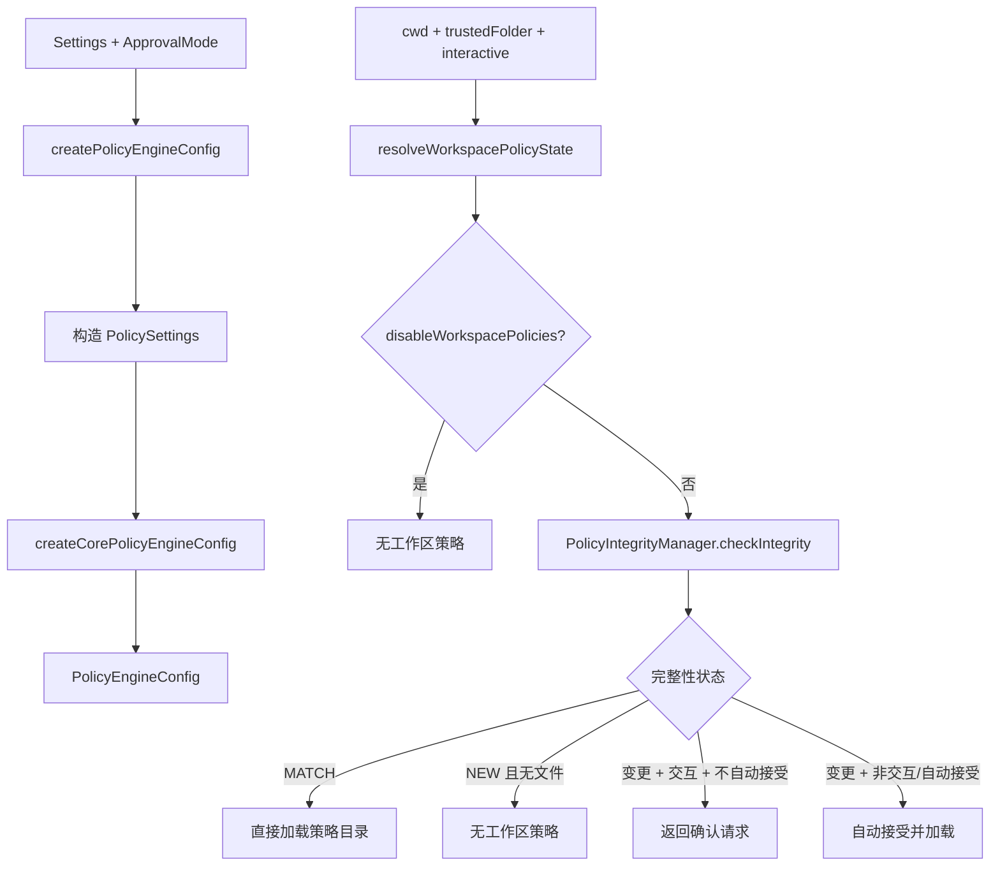

# policy.ts

> 策略引擎的 CLI 层适配模块，负责创建策略引擎配置并解析工作区策略的完整性状态。

## 概述

`policy.ts` 是策略引擎（Policy Engine）在 CLI 层的适配器。它将 CLI 的 `Settings` 类型转换为 Core 所需的 `PolicySettings`，调用 Core 的 `createCorePolicyEngineConfig` 生成策略引擎配置。同时通过 `resolveWorkspacePolicyState` 处理工作区级策略的完整性校验——判断策略文件是否存在、是否发生变更，以及是否需要用户确认。

模块还暴露了两个可配置标志：`autoAcceptWorkspacePolicies`（是否自动接受工作区策略变更）和 `disableWorkspacePolicies`（是否完全禁用工作区策略），主要用于开发和测试场景。

## 架构图（mermaid）

## 主要导出

| 导出名称 | 类型 | 说明 |
|---------|------|------|
| `autoAcceptWorkspacePolicies` | `let boolean` | 是否自动接受工作区策略变更（默认 `true`） |
| `setAutoAcceptWorkspacePolicies` | `(value: boolean) => void` | 设置自动接受标志（测试用） |
| `disableWorkspacePolicies` | `let boolean` | 是否完全禁用工作区策略（默认 `true`） |
| `setDisableWorkspacePolicies` | `(value: boolean) => void` | 设置禁用标志（测试用） |
| `createPolicyEngineConfig` | `(settings, approvalMode, workspacePoliciesDir?) => Promise<PolicyEngineConfig>` | 从 CLI 设置创建策略引擎配置 |
| `createPolicyUpdater` | `(policyEngine, messageBus, storage) => ...` | 创建策略更新器（委托给 Core） |
| `WorkspacePolicyState` | `interface` | 工作区策略状态：可选的策略目录和更新确认请求 |
| `resolveWorkspacePolicyState` | `(options) => Promise<WorkspacePolicyState>` | 解析工作区策略状态 |

## 核心逻辑

### createPolicyEngineConfig

1. 从 `Settings` 中提取策略相关字段构造 `PolicySettings`：`mcp`、`tools`、`mcpServers`、`policyPaths`、`adminPolicyPaths`、`workspacePoliciesDir`、`disableAlwaysAllow`。
2. 委托给 Core 的 `createCorePolicyEngineConfig` 生成最终配置。

### resolveWorkspacePolicyState

1. 若 `disableWorkspacePolicies` 为 `true` 或文件夹不受信任，跳过。
2. 若 `Storage` 判断工作区是 home 目录，跳过（避免重复加载全局策略）。
3. 使用 `PolicyIntegrityManager.checkIntegrity` 检查工作区策略目录的完整性。
4. 根据完整性状态（`MATCH` / `NEW` / 变更）分支处理：
   - **匹配**：直接使用策略目录。
   - **新建且无文件**：无策略。
   - **变更 + 交互 + 不自动接受**：返回 `PolicyUpdateConfirmationRequest` 让 UI 层提示用户。
   - **变更 + 非交互/自动接受**：自动调用 `acceptIntegrity` 并加载。

## 内部依赖

| 模块 | 导入内容 | 用途 |
|------|---------|------|
| `./settings.js` | `Settings`（类型） | CLI 设置类型 |

## 外部依赖

| 模块 | 导入内容 | 用途 |
|------|---------|------|
| `@google/gemini-cli-core` | `PolicyEngineConfig`, `ApprovalMode`, `PolicyEngine`, `MessageBus`, `PolicyIntegrityManager`, `IntegrityStatus`, `Storage`, `writeToStderr`, `debugLogger` 等 | 策略引擎核心类型与工具 |
