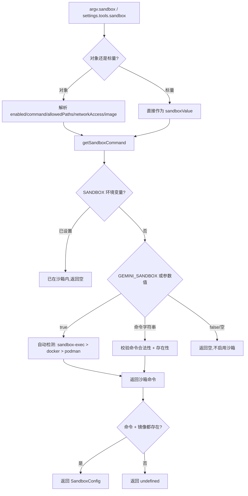

# sandboxConfig.ts

> 沙箱配置加载模块，负责检测和选择合适的沙箱命令（Docker、Podman、sandbox-exec、gVisor、LXC），并构建沙箱运行时配置。

## 概述

`sandboxConfig.ts` 处理 Gemini CLI 的沙箱化运行配置。它支持五种沙箱命令：`docker`、`podman`、`sandbox-exec`（macOS Seatbelt）、`runsc`（gVisor，仅 Linux）和 `lxc`。模块实现了沙箱命令的自动检测与手动指定逻辑，最终输出一个 `SandboxConfig` 对象用于 CLI 运行时。

## 架构图（mermaid）

## 主要导出

| 导出名称 | 类型 | 说明 |
|---------|------|------|
| `loadSandboxConfig` | `(settings: Settings, argv: SandboxCliArgs) => Promise<SandboxConfig \| undefined>` | 加载沙箱配置，返回 `undefined` 表示不启用沙箱 |

## 核心逻辑

### getSandboxCommand（内部函数）

优先级与检测逻辑：

1. **已在沙箱中**：`SANDBOX` 环境变量存在 -> 返回空字符串。
2. **环境变量优先**：`GEMINI_SANDBOX` 环境变量优先于命令行参数。
3. **布尔值处理**：`true/1` -> 自动检测；`false/0` -> 不启用。
4. **指定命令**：校验是否在 `VALID_SANDBOX_COMMANDS` 列表中，检查命令是否存在（`commandExists.sync`），`runsc` 额外要求 Linux 平台和 Docker 可用。
5. **自动检测**：
   - macOS + `sandbox-exec` 可用 -> `sandbox-exec`
   - `docker` 可用 + 显式启用 -> `docker`
   - `podman` 可用 + 显式启用 -> `podman`
   - `lxc` 不自动检测，必须显式指定。
6. **显式启用但无可用命令** -> 抛出 `FatalSandboxError`。

### loadSandboxConfig

1. 解析 `argv.sandbox` 或 `settings.tools.sandbox`（支持布尔值或详细对象配置）。
2. 对象配置支持：`enabled`、`command`、`allowedPaths`、`networkAccess`、`image`。
3. 调用 `getSandboxCommand` 获取命令。
4. 镜像来源优先级：`GEMINI_SANDBOX_IMAGE` env > `GEMINI_SANDBOX_IMAGE_DEFAULT` env > 自定义 image > `package.json` 中的 `config.sandboxImageUri`。
5. 命令和镜像都存在时返回 `SandboxConfig`，否则返回 `undefined`。

## 内部依赖

| 模块 | 导入内容 | 用途 |
|------|---------|------|
| `./settings.js` | `Settings`（类型） | 设置类型 |

## 外部依赖

| 模块 | 导入内容 | 用途 |
|------|---------|------|
| `@google/gemini-cli-core` | `getPackageJson`, `SandboxConfig`, `FatalSandboxError` | 包信息获取、沙箱配置类型、错误类型 |
| `command-exists` | `commandExists` | 检查系统命令是否存在 |
| `node:os` | `os` | 获取操作系统平台信息 |
| `node:url` | `fileURLToPath` | 模块 URL 转文件路径 |
| `node:path` | `path` | 路径操作 |
