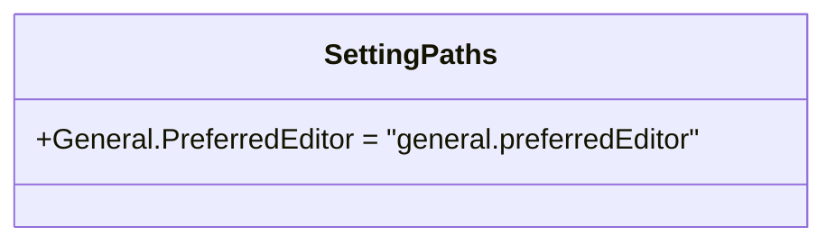

# settingPaths.ts

> 定义设置路径常量，提供类型安全的点分隔设置键名集合。

## 概述

`settingPaths.ts` 是一个极简的常量定义模块，通过 `as const` 断言将设置路径定义为不可变的字面量类型。目前仅包含一个设置路径 `general.preferredEditor`，用于在代码中引用设置键名时提供类型安全保证，避免字符串拼写错误。

## 架构图（mermaid）

## 主要导出

| 导出名称 | 类型 | 说明 |
|---------|------|------|
| `SettingPaths` | `const object` | 设置路径常量集合 |

### 当前定义的路径

| 常量路径 | 值 | 说明 |
|---------|-----|------|
| `SettingPaths.General.PreferredEditor` | `"general.preferredEditor"` | 用户首选编辑器的设置键 |

## 核心逻辑

使用 `as const` 确保 TypeScript 将值推断为字面量类型而非宽泛的 `string` 类型，这样在引用 `SettingPaths.General.PreferredEditor` 时，编译器可以确保其值恒为 `"general.preferredEditor"`。

## 内部依赖

无。

## 外部依赖

无。
