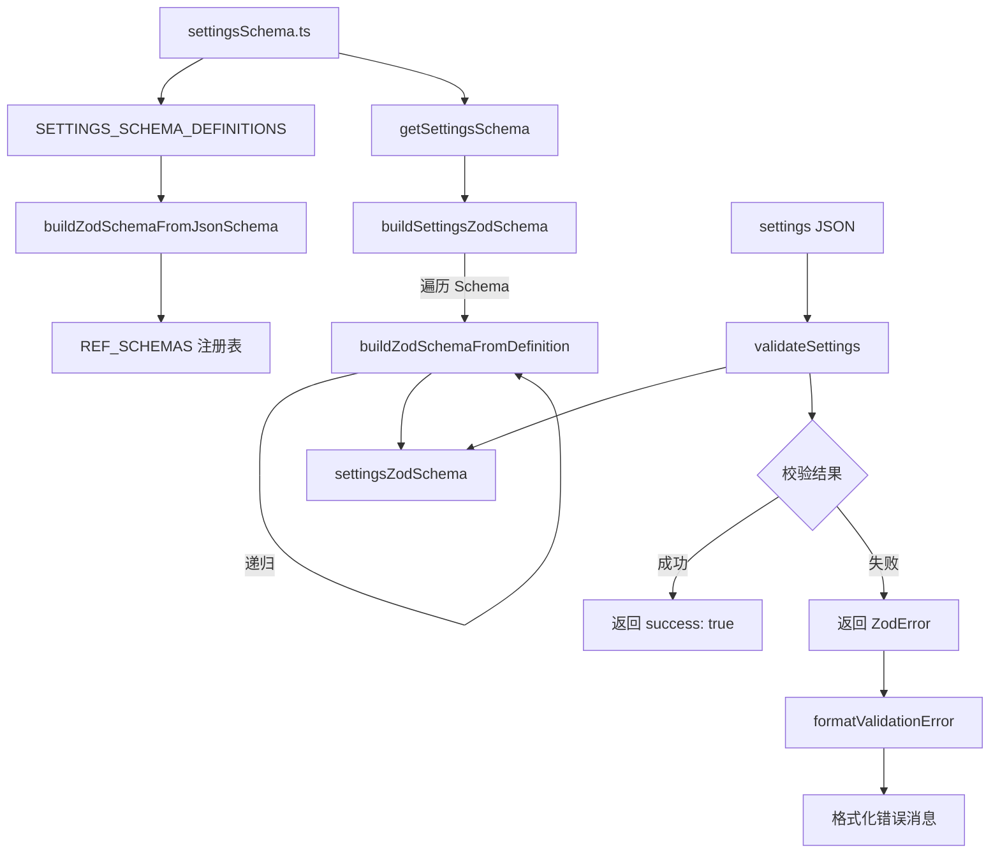

# settings-validation.ts

> 基于 Zod 的设置校验模块，将 `settingsSchema.ts` 中的声明式 Schema 转换为 Zod 运行时校验器。

## 概述

`settings-validation.ts` 是设置校验的核心模块。它从 `settingsSchema.ts` 读取声明式的 `SettingDefinition` Schema，自动生成对应的 Zod 验证器（`settingsZodSchema`），用于在加载设置文件时进行结构和类型校验。校验失败时会生成用户友好的错误消息，包含路径、期望类型与实际类型的对比信息。

## 架构图（mermaid）

## 主要导出

| 导出名称 | 类型 | 说明 |
|---------|------|------|
| `settingsZodSchema` | `z.ZodObject<...>` | 从 Schema 自动生成的完整 Zod 设置校验器 |
| `validateSettings` | `(data: unknown) => { success, data?, error? }` | 校验设置数据，返回 `safeParse` 结果 |
| `formatValidationError` | `(error: z.ZodError, filePath: string) => string` | 将 Zod 错误格式化为用户友好的多行错误消息 |

## 核心逻辑

### Schema 到 Zod 的转换

模块包含三层转换逻辑：

**1. `buildZodSchemaFromJsonSchema`（JSON Schema 风格 -> Zod）**：
处理 `SETTINGS_SCHEMA_DEFINITIONS` 中的引用类型定义（如 `TelemetrySettings`、`MCPServerConfig`）。支持 `anyOf`、`string`（含 enum）、`number`、`boolean`、`array`、`object`（含 `properties`、`additionalProperties`、`required`、`strict`）。

**2. `buildZodSchemaFromDefinition`（SettingDefinition -> Zod）**：
处理主 Schema 中的每个设置项。特殊处理：
- `TelemetrySettings`：支持 `boolean | object` 联合类型。
- `ref` 引用：从 `REF_SCHEMAS` 注册表查找。
- `enum` 类型：通过 `buildEnumSchema` 构建，支持 `string`、`number`、混合值。
- `object` 类型：递归处理 `properties` 和 `additionalProperties`。
- `array` 类型：递归处理 `items`。
- 所有字段默认 `.optional()`。

**3. `buildZodSchemaFromCollection`（SettingCollectionDefinition -> Zod）**：
处理数组元素和嵌套对象的子类型定义。

### REF_SCHEMAS 注册表

在模块初始化时，遍历 `SETTINGS_SCHEMA_DEFINITIONS` 将所有引用类型预编译为 Zod Schema，存入 `REF_SCHEMAS` 字典供后续 `$ref` 查找。

### validateSettings

简单封装 `settingsZodSchema.safeParse(data)`，返回标准结果对象。

### formatValidationError

1. 最多显示 5 个错误（`MAX_ERRORS_TO_DISPLAY`）。
2. 将 `issue.path` 数组格式化为点分隔路径（数组索引用 `[n]`）。
3. 对 `invalid_type` 类型错误额外显示"期望 vs 实际"。
4. 超出 5 个错误时提示剩余数量。
5. 末尾附加修复建议和文档链接。

## 内部依赖

| 模块 | 导入内容 | 用途 |
|------|---------|------|
| `./settingsSchema.js` | `getSettingsSchema`, `SettingDefinition`, `SettingCollectionDefinition`, `SETTINGS_SCHEMA_DEFINITIONS` | 设置 Schema 定义与引用类型 |

## 外部依赖

| 模块 | 导入内容 | 用途 |
|------|---------|------|
| `zod` | `z` | 运行时数据校验库 |
