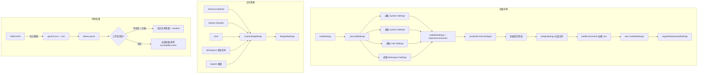

# settings.ts

> 设置系统的核心模块，负责多层级设置文件的加载、合并、持久化、环境变量注入以及废弃设置的自动迁移。

## 概述

`settings.ts`（约 1209 行）是 Gemini CLI 设置系统的中枢。它实现了一个完整的多层级设置体系：

- **四层设置来源**：System Defaults -> User -> Workspace -> System（作为覆盖），优先级递增。
- **设置文件加载**：从磁盘读取 JSON（支持注释），通过 Zod 校验，解析环境变量引用。
- **设置合并**：基于自定义深度合并策略（支持 replace、concat、union、shallow_merge）。
- **环境变量注入**：从 `.env` 文件加载环境变量，支持分层查找、Cloud Shell 特殊处理、安全消毒。
- **废弃设置迁移**：自动将旧版设置（如 `disableAutoUpdate` -> `enableAutoUpdate`、`tools.approvalMode` -> `general.defaultApprovalMode`）迁移到新版。
- **响应式更新**：通过 `LoadedSettings` 类提供 `subscribe` / `getSnapshot` 接口，与 React 的 `useSyncExternalStore` 集成。

## 架构图（mermaid）

## 主要导出

| 导出名称 | 类型 | 说明 |
|---------|------|------|
| `Settings`, `MergedSettings`, `MemoryImportFormat`, `MergeStrategy`, `SettingsSchema`, `SettingDefinition`, `getSettingsSchema` | 类型重导出 | 从 `settingsSchema.js` 重导出的核心类型 |
| `SettingScope` | `enum` | 设置作用域：`User`、`Workspace`、`System`、`SystemDefaults`、`Session` |
| `LoadableSettingScope` | `type` | 可加载的设置作用域（排除 Session） |
| `isLoadableSettingScope` | `(scope) => boolean` | 类型守卫 |
| `CheckpointingSettings` | `interface` | 检查点设置 |
| `SummarizeToolOutputSettings` | `interface` | 工具输出摘要设置 |
| `LoadingPhrasesMode` | `type` | 加载短语模式：`tips`/`witty`/`all`/`off` |
| `AccessibilitySettings` | `interface` | 无障碍设置 |
| `SessionRetentionSettings` | `interface` | 会话保留设置 |
| `SettingsError` | `interface` | 设置错误：message、path、severity |
| `SettingsFile` | `interface` | 设置文件结构：settings、originalSettings、path、rawJson、readOnly |
| `LoadedSettingsSnapshot` | `interface` | 设置快照（不可变），用于 `useSyncExternalStore` |
| `LoadedSettings` | `class` | 已加载设置的核心类 |
| `USER_SETTINGS_PATH` | `const string` | 用户设置文件路径 |
| `USER_SETTINGS_DIR` | `const string` | 用户设置目录路径 |
| `DEFAULT_EXCLUDED_ENV_VARS` | `const string[]` | 默认排除的环境变量 |
| `sanitizeEnvVar` | `(value: string) => string` | 环境变量值消毒（仅保留安全字符） |
| `getSystemSettingsPath` | `() => string` | 获取系统设置路径（跨平台） |
| `getSystemDefaultsPath` | `() => string` | 获取系统默认设置路径 |
| `getMergeStrategyForPath` | `(path: string[]) => MergeStrategy \| undefined` | 根据 Schema 获取指定路径的合并策略 |
| `getDefaultsFromSchema` | `(schema?) => Settings` | 从 Schema 提取默认值 |
| `mergeSettings` | `(system, systemDefaults, user, workspace, isTrusted) => MergedSettings` | 五层设置合并 |
| `createTestMergedSettings` | `(overrides?) => MergedSettings` | 测试用：默认值 + 覆盖合并 |
| `loadSettings` | `(workspaceDir?) => LoadedSettings` | 加载设置（带 10 秒缓存） |
| `loadEnvironment` | `(settings, workspaceDir, isWorkspaceTrustedFn?) => void` | 从 `.env` 文件加载环境变量到 `process.env` |
| `setUpCloudShellEnvironment` | `(envFilePath, isTrusted, isSandboxed) => void` | Cloud Shell 特殊处理 |
| `saveSettings` | `(settingsFile: SettingsFile) => void` | 保存设置文件（保留格式） |
| `saveModelChange` | `(loadedSettings, model) => void` | 保存模型切换 |
| `migrateDeprecatedSettings` | `(loadedSettings, removeDeprecated?) => boolean` | 自动迁移废弃设置 |
| `resetSettingsCacheForTesting` | `() => void` | 重置缓存（测试用） |

## 核心逻辑

### LoadedSettings 类

| 方法/属性 | 说明 |
|-----------|------|
| `merged` | 合并后的只读设置（getter，内部缓存） |
| `setTrusted(isTrusted)` | 更新信任状态，重新计算合并设置 |
| `setValue(scope, key, value)` | 设置指定作用域的值，自动持久化和通知 |
| `setRemoteAdminSettings(settings)` | 设置远程管理员控制，优先于文件设置 |
| `subscribe(listener)` | 订阅设置变更事件（与 React 集成） |
| `getSnapshot()` | 获取不可变快照（`structuredClone`） |
| `forScope(scope)` | 按作用域获取设置文件 |

**管理员设置特殊处理**：`computeMergedSettings` 中，`admin` 字段始终使用 Schema 默认值 + 远程管理员设置覆盖，忽略文件中的 admin 设置。

### loadSettings / _doLoadSettings

1. 带 10 秒 TTL 缓存的入口函数。
2. 按顺序读取 4 个设置文件（System、SystemDefaults、User、Workspace）。
3. 每个文件：读取 -> 去除注释 -> JSON 解析 -> Zod 校验 -> 环境变量解析。
4. 初始信任检查（仅用 system + user 设置）。
5. 临时合并设置用于 `loadEnvironment`（需要设置来确定 `.env` 加载策略）。
6. 致命错误检查。
7. 创建 `LoadedSettings` 实例。
8. 执行废弃设置迁移。
9. 旧版主题名称迁移（`VS` -> `DefaultLight`，`VS2015` -> `DefaultDark`）。

### loadEnvironment

1. `findEnvFile`：从工作目录向上搜索 `.gemini/.env` 或 `.env`，最后回退到 `~/.gemini/.env` 或 `~/.env`。
2. Cloud Shell 特殊处理：默认使用 `cloudshell-gca` 作为 `GOOGLE_CLOUD_PROJECT`。
3. 安全策略：不信任 + 沙箱 -> 仅加载白名单变量（`GEMINI_API_KEY` 等）并消毒。
4. 项目 `.env` 文件跳过 `excludedEnvVars`（默认 `DEBUG`、`DEBUG_MODE`）。
5. 已存在的环境变量不被覆盖。

### migrateDeprecatedSettings

迁移映射：
- `general.disableAutoUpdate` -> `general.enableAutoUpdate`（取反）
- `general.disableUpdateNag` -> `general.enableAutoUpdateNotification`（取反）
- `ui.accessibility.disableLoadingPhrases` -> `ui.accessibility.enableLoadingPhrases`（取反）
- `ui.accessibility.enableLoadingPhrases: false` -> `ui.loadingPhrases: 'off'`
- `context.fileFiltering.disableFuzzySearch` -> `context.fileFiltering.enableFuzzySearch`（取反）
- `tools.approvalMode` -> `general.defaultApprovalMode`
- `experimental.codebaseInvestigatorSettings` -> `agents.overrides.codebase_investigator`
- `experimental.cliHelpAgentSettings` -> `agents.overrides.cli_help`

只读设置文件（System、SystemDefaults）不会被修改，但会发出警告。

## 内部依赖

| 模块 | 导入内容 | 用途 |
|------|---------|------|
| `./settingsSchema.js` | `Settings`, `MergedSettings`, `getSettingsSchema` 等 | Schema 定义与类型 |
| `./settings-validation.js` | `validateSettings`, `formatValidationError` | Zod 校验 |
| `./trustedFolders.js` | `isWorkspaceTrusted` | 工作区信任判定 |
| `../utils/envVarResolver.js` | `resolveEnvVarsInObject` | 环境变量解析 |
| `../utils/deepMerge.js` | `customDeepMerge` | 自定义深度合并 |
| `../utils/commentJson.js` | `updateSettingsFilePreservingFormat` | 保留格式的 JSON 更新 |
| `../ui/themes/builtin/...` | `DefaultLight`, `DefaultDark` | 内置主题名称常量 |

## 外部依赖

| 模块 | 导入内容 | 用途 |
|------|---------|------|
| `@google/gemini-cli-core` | `CoreEvent`, `FatalConfigError`, `Storage`, `GEMINI_DIR`, `homedir`, `coreEvents`, `createCache` 等 | 核心事件、错误、存储、缓存 |
| `strip-json-comments` | `stripJsonComments` | 解析带注释的 JSON |
| `dotenv` | `dotenv` | `.env` 文件解析 |
| `node:fs` | `fs` | 文件系统操作 |
| `node:path` | `path` | 路径操作 |
| `node:os` | `platform` | 操作系统平台检测 |
| `node:process` | `process` | 进程环境 |
