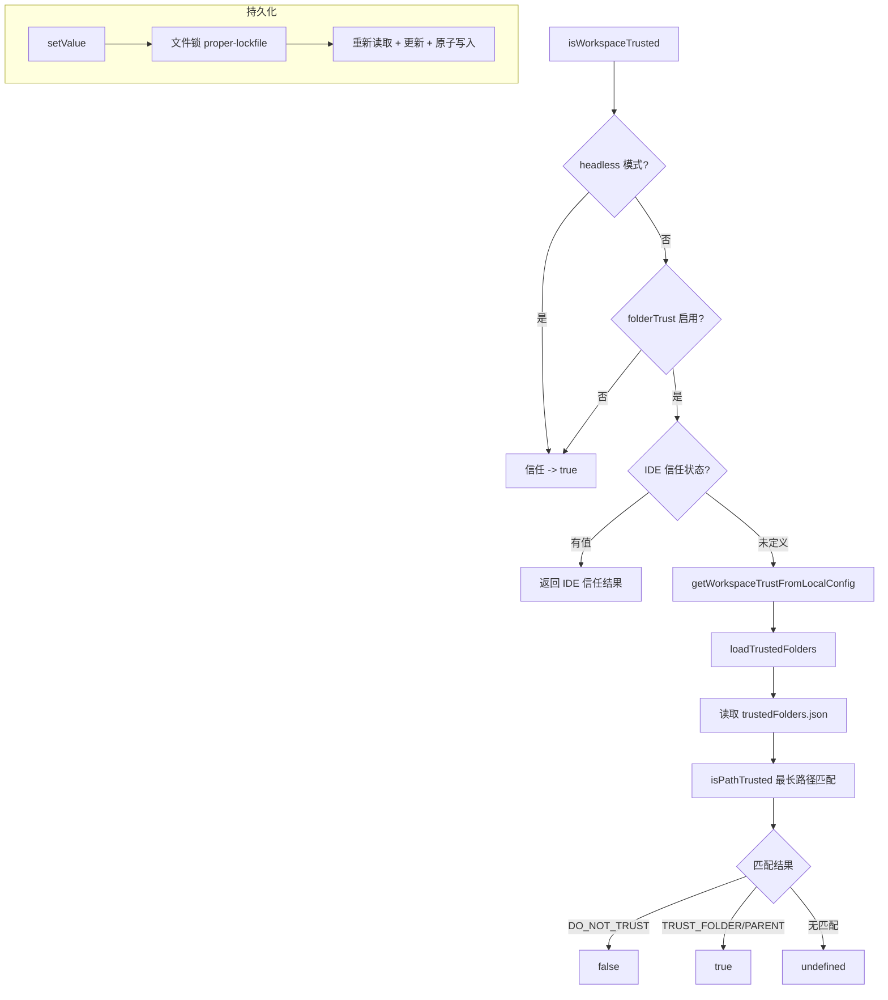

# trustedFolders.ts

> 工作区文件夹信任管理模块，负责加载、校验、持久化文件夹信任配置，并判定当前工作区是否受信任。

## 概述

`trustedFolders.ts` 实现了 Gemini CLI 的文件夹信任机制。该机制允许用户将特定目录标记为"受信任"或"不受信任"，从而控制 CLI 在该目录下的行为（如是否加载工作区设置、是否允许 YOLO 模式等）。信任配置存储在用户主目录下的 `~/.gemini/trustedFolders.json` 文件中。

模块支持三种信任级别：`TRUST_FOLDER`（信任当前目录）、`TRUST_PARENT`（信任父目录下的所有子目录）、`DO_NOT_TRUST`（明确不信任）。信任判定采用最长路径匹配策略，并通过 `realpath` 解析符号链接确保路径一致性。

## 架构图（mermaid）

## 主要导出

| 导出名称 | 类型 | 说明 |
|---------|------|------|
| `TRUSTED_FOLDERS_FILENAME` | `const string` | 信任配置文件名：`trustedFolders.json` |
| `getUserSettingsDir` | `() => string` | 获取用户设置目录路径 `~/.gemini/` |
| `getTrustedFoldersPath` | `() => string` | 获取信任配置文件完整路径 |
| `TrustLevel` | `enum` | 信任级别枚举：`TRUST_FOLDER`、`TRUST_PARENT`、`DO_NOT_TRUST` |
| `isTrustLevel` | `(value) => value is TrustLevel` | 类型守卫函数 |
| `TrustRule` | `interface` | 信任规则：路径 + 信任级别 |
| `TrustedFoldersError` | `interface` | 错误信息：message + path |
| `TrustedFoldersFile` | `interface` | 信任配置文件结构：config 记录 + path |
| `TrustResult` | `interface` | 信任判定结果：`isTrusted` + `source`（`ide` / `file`） |
| `LoadedTrustedFolders` | `class` | 已加载的信任配置，含规则列表、路径判定和值设置 |
| `loadTrustedFolders` | `() => LoadedTrustedFolders` | 加载并缓存信任配置（单例模式） |
| `saveTrustedFolders` | `(file: TrustedFoldersFile) => void` | 原子写入信任配置文件 |
| `isFolderTrustEnabled` | `(settings: Settings) => boolean` | 检查文件夹信任功能是否启用 |
| `isWorkspaceTrusted` | `(settings, workspaceDir?, trustConfig?, headlessOptions?) => TrustResult` | 综合判定工作区是否受信任 |
| `clearRealPathCacheForTesting` | `() => void` | 清除 realpath 缓存（测试用） |
| `resetTrustedFoldersForTesting` | `() => void` | 重置内存缓存（测试用） |

## 核心逻辑

### LoadedTrustedFolders 类

**`isPathTrusted(location, config?, headlessOptions?)`**：
1. Headless 模式下直接返回 `true`。
2. 将待判定路径和规则路径都解析为 `realpath`（带缓存）。
3. 对 `TRUST_PARENT` 规则取其 `dirname` 作为有效路径。
4. 使用 `isWithinRoot` 检查位置是否在规则路径内。
5. 最长路径匹配策略：多条规则命中时以路径最长（最具体）的为准。
6. `DO_NOT_TRUST` -> `false`；`TRUST_FOLDER` / `TRUST_PARENT` -> `true`；无匹配 -> `undefined`。

**`setValue(folderPath, trustLevel)`**：
1. 检查配置文件是否有错误，有则拒绝修改。
2. 使用 `proper-lockfile` 文件锁（最多重试 10 次）保证并发安全。
3. 锁内重新读取文件处理并发更新。
4. 更新内存和文件中的配置。
5. 写入失败时回滚内存变更。

### saveTrustedFolders

使用临时文件 + `rename` 的原子写入策略，文件权限 `0o600`（仅用户可读写）。

### isWorkspaceTrusted

信任判定优先级：
1. Headless 模式 -> 信任。
2. `folderTrust` 未启用 -> 信任。
3. IDE 上下文中的 `workspaceState.isTrusted` -> 使用 IDE 判定。
4. 本地配置文件判定 -> 使用 `loadTrustedFolders` 结果。

## 内部依赖

| 模块 | 导入内容 | 用途 |
|------|---------|------|
| `./settings.js` | `Settings`（类型） | 设置类型 |

## 外部依赖

| 模块 | 导入内容 | 用途 |
|------|---------|------|
| `@google/gemini-cli-core` | `FatalConfigError`, `getErrorMessage`, `isWithinRoot`, `ideContextStore`, `GEMINI_DIR`, `homedir`, `isHeadlessMode`, `coreEvents` | 错误处理、路径判定、IDE 上下文、核心常量与事件 |
| `strip-json-comments` | `stripJsonComments` | 解析带注释的 JSON |
| `proper-lockfile` | `lock` | 文件锁机制 |
| `node:fs` | `fs`, `fsPromises` | 文件系统操作 |
| `node:path` | `path` | 路径操作 |
| `node:crypto` | `crypto` | 临时文件名生成 |
