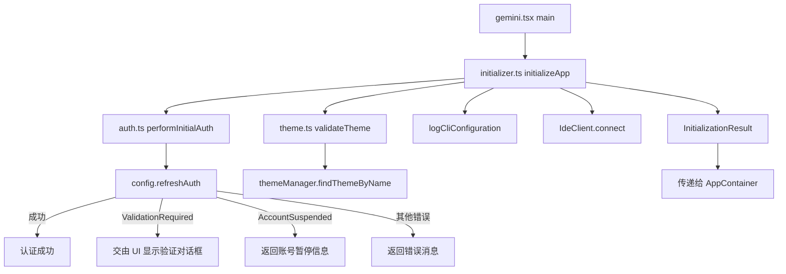

# core 架构

> CLI 应用的初始化层，在 React UI 渲染前执行认证、主题验证和 IDE 连接等启动任务。

## 概述

`core/` 目录包含 CLI 应用的初始化逻辑，这些代码在 React UI 渲染之前执行。它负责三项关键的启动任务：初始认证流程、主题配置验证和 IDE 连接建立。初始化结果通过 `InitializationResult` 接口传递给 UI 层，使 UI 能够根据认证状态显示相应的对话框。

## 架构图



## 目录结构

```
core/
├── initializer.ts    # 应用初始化编排器
├── auth.ts           # 初始认证流程
└── theme.ts          # 主题验证
```

## 关键文件

| 文件 | 功能 |
|------|------|
| `initializer.ts` | `initializeApp()` 函数 - 初始化编排器。定义 `InitializationResult` 接口（authError、accountSuspensionInfo、themeError、shouldOpenAuthDialog、geminiMdFileCount）。按顺序执行：认证 -> 主题验证 -> 配置日志 -> IDE 连接。返回结果供 UI 层使用 |
| `auth.ts` | `performInitialAuth()` 函数 - 初始认证处理。调用 `config.refreshAuth(authType)` 执行认证；处理特殊错误：`ValidationRequiredError` 不视为致命错误（由 UI 处理）、账号暂停错误返回 `AccountSuspensionInfo`（含 appealUrl）、`ProjectIdRequiredError` 直接显示错误消息 |
| `theme.ts` | `validateTheme()` 函数 - 验证用户配置的主题是否存在于主题管理器中，不存在则返回错误消息 |

## 内部依赖

- `../config/settings.ts` - `LoadedSettings` 类型
- `../ui/contexts/UIStateContext.ts` - `AccountSuspensionInfo` 类型
- `../ui/themes/theme-manager.ts` - `themeManager` 主题管理器

## 外部依赖

| 依赖 | 用途 |
|------|------|
| `@google/gemini-cli-core` | Config、AuthType、IdeClient、IdeConnectionEvent、logIdeConnection、logCliConfiguration、StartSessionEvent、startupProfiler、ValidationRequiredError、isAccountSuspendedError、ProjectIdRequiredError、getErrorMessage |
