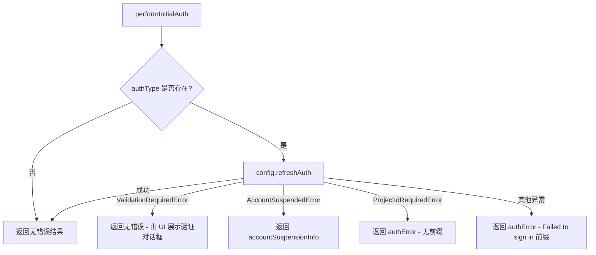

# auth.ts

> 处理应用启动阶段的初始认证流程，返回认证错误或账号封禁信息。

## 概述

`auth.ts` 封装了 CLI 启动时的认证逻辑。它调用 `config.refreshAuth()` 刷新指定认证类型的凭证，并将各类认证异常（验证待确认、账号被封禁、需要项目 ID、一般登录失败）转换为统一的 `InitialAuthResult` 结构，供上层初始化流程消费。

## 架构图（mermaid）

## 主要导出

| 导出 | 类型 | 说明 |
|---|---|---|
| `InitialAuthResult` | 接口 | 包含 `authError`（错误消息或 null）和 `accountSuspensionInfo`（封禁信息或 null） |
| `performInitialAuth` | 异步函数 | 执行初始认证，返回 `InitialAuthResult` |

## 核心逻辑

`performInitialAuth(config, authType)` 的执行流程：

1. 若 `authType` 为 `undefined`，直接返回无错误结果（跳过认证）。
2. 调用 `config.refreshAuth(authType)` 刷新认证令牌。
3. 异常分支处理：
   - **`ValidationRequiredError`**：认证需要用户进一步验证（如 OAuth 确认），不视为致命错误，返回无错误结果，让 React UI 渲染验证对话框。
   - **账号封禁错误**：通过 `isAccountSuspendedError(e)` 检测，返回封禁消息、申诉链接等信息。
   - **`ProjectIdRequiredError`**：OAuth 成功但缺少项目 ID，返回原始错误消息。
   - **其他错误**：返回带 `Failed to sign in` 前缀的错误消息。

## 内部依赖

| 模块 | 用途 |
|---|---|
| `../ui/contexts/UIStateContext.js` | 提供 `AccountSuspensionInfo` 类型定义 |

## 外部依赖

| 模块 | 用途 |
|---|---|
| `@google/gemini-cli-core` | 提供 `AuthType`、`Config` 类型，`getErrorMessage` 工具函数，以及 `ValidationRequiredError`、`isAccountSuspendedError`、`ProjectIdRequiredError` 等错误类型 |
