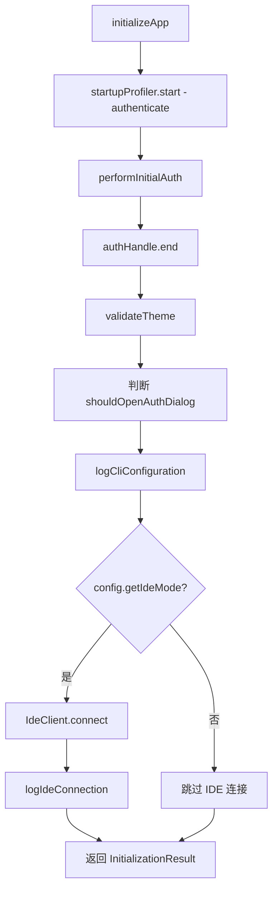

# initializer.ts

> 编排应用程序启动阶段的初始化流程，在 React UI 渲染之前完成认证、主题校验和 IDE 连接。

## 概述

`initializer.ts` 是 CLI 启动流程的核心编排器。它在 React UI 渲染之前顺序执行以下任务：

1. 通过 `performInitialAuth` 完成初始认证（带性能埋点）。
2. 通过 `validateTheme` 校验用户配置的主题是否存在。
3. 记录 CLI 配置日志和会话启动事件。
4. 若处于 IDE 模式，建立 IDE 客户端连接。
5. 汇总所有结果为 `InitializationResult` 返回给调用方。

## 架构图（mermaid）

## 主要导出

| 导出 | 类型 | 说明 |
|---|---|---|
| `InitializationResult` | 接口 | 包含 `authError`、`accountSuspensionInfo`、`themeError`、`shouldOpenAuthDialog`、`geminiMdFileCount` 五个字段 |
| `initializeApp` | 异步函数 | 接收 `Config` 和 `LoadedSettings`，返回 `InitializationResult` |

## 核心逻辑

`initializeApp(config, settings)` 的执行步骤：

| 步骤 | 说明 |
|---|---|
| 认证 | 使用 `startupProfiler` 计时，调用 `performInitialAuth` 获取认证结果 |
| 主题校验 | 调用 `validateTheme(settings)` 检查配置的主题名是否有效 |
| 认证对话框判断 | 当 `selectedType` 未定义或存在 `authError` 时，标记 `shouldOpenAuthDialog = true` |
| 配置日志 | 调用 `logCliConfiguration` 记录当前配置和 `StartSessionEvent` |
| IDE 模式 | 若启用 IDE 模式，获取 `IdeClient` 单例并建立连接，记录连接事件 |
| 结果汇总 | 返回包含所有初始化状态的 `InitializationResult` 对象 |

## 内部依赖

| 模块 | 用途 |
|---|---|
| `../config/settings.js` | 提供 `LoadedSettings` 类型 |
| `./auth.js` | 提供 `performInitialAuth` 认证函数 |
| `./theme.js` | 提供 `validateTheme` 主题校验函数 |
| `../ui/contexts/UIStateContext.js` | 提供 `AccountSuspensionInfo` 类型 |

## 外部依赖

| 模块 | 用途 |
|---|---|
| `@google/gemini-cli-core` | 提供 `IdeClient`、`IdeConnectionEvent`、`IdeConnectionType`、`logIdeConnection`、`Config`、`StartSessionEvent`、`logCliConfiguration`、`startupProfiler` 等 |
