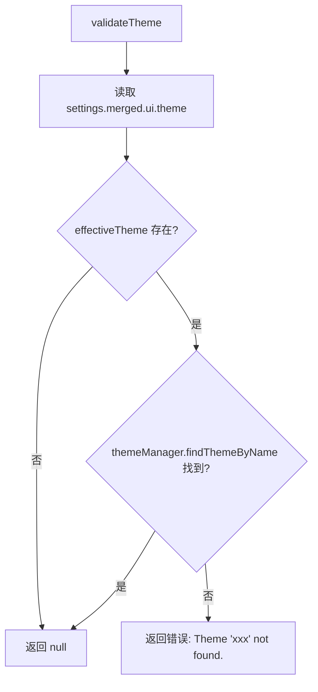

# theme.ts

> 校验用户配置的主题名称是否在主题管理器中存在。

## 概述

`theme.ts` 提供了一个简洁的主题校验函数 `validateTheme`。它从用户加载的设置中读取 `ui.theme` 配置项，然后通过 `themeManager.findThemeByName()` 查找该主题是否已注册。若主题名非空但未找到匹配的主题，则返回错误消息；否则返回 `null` 表示校验通过。

## 架构图（mermaid）

## 主要导出

| 导出 | 类型 | 说明 |
|---|---|---|
| `validateTheme` | 函数 | 接收 `LoadedSettings`，返回 `string | null`（错误消息或 null） |

## 核心逻辑

`validateTheme(settings)` 逻辑非常简单：

1. 从 `settings.merged.ui.theme` 获取用户配置的主题名。
2. 若主题名为空/未设置，返回 `null`（使用默认主题）。
3. 若主题名非空，调用 `themeManager.findThemeByName(effectiveTheme)` 查找。
4. 找到则返回 `null`，找不到则返回 `Theme "${effectiveTheme}" not found.` 错误字符串。

## 内部依赖

| 模块 | 用途 |
|---|---|
| `../ui/themes/theme-manager.js` | 提供 `themeManager` 单例，用于按名称查找主题 |
| `../config/settings.js` | 提供 `LoadedSettings` 类型定义 |

## 外部依赖

无外部依赖。
