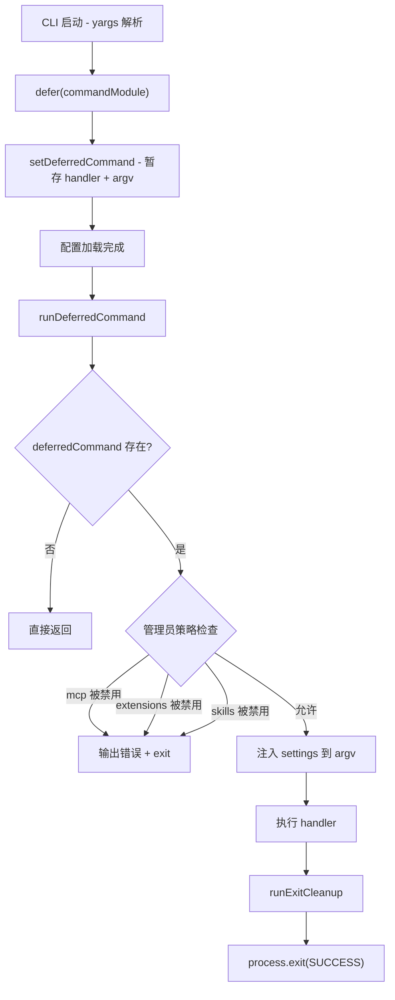

# deferred.ts

> 提供延迟命令执行机制，将 yargs 子命令的 handler 推迟到配置加载完成后再运行。

## 概述

`deferred.ts` 实现了一套"延迟命令"模式。在 CLI 启动时，yargs 解析命令行参数并匹配到子命令（如 `mcp`、`extensions`、`skills`），但此时应用配置尚未完全加载。`defer()` 函数将子命令的 handler 和参数暂存到模块级单例变量中，待配置加载完毕后由 `runDeferredCommand()` 执行。执行前还会检查管理员策略（admin settings），若相关功能被禁用则输出错误并退出。

## 架构图（mermaid）

## 主要导出

| 导出 | 类型 | 说明 |
|---|---|---|
| `DeferredCommand` | 接口 | 包含 `handler`、`argv`、`commandName` 三个字段 |
| `setDeferredCommand` | 函数 | 设置延迟命令单例 |
| `runDeferredCommand` | 异步函数 | 执行延迟命令（带管理员策略检查），完成后清理并退出 |
| `defer` | 泛型函数 | 包装 `CommandModule`，将其 handler 替换为延迟存储逻辑 |

## 核心逻辑

### `defer(commandModule, parentCommandName?)`

- 返回一个新的 `CommandModule`，保留原模块的所有属性（`command`、`describe`、`builder` 等）。
- 将 `handler` 替换为调用 `setDeferredCommand` 的函数，暂存原始 handler、argv 和命令名。

### `runDeferredCommand(settings)`

1. 若无暂存命令，直接返回。
2. 根据 `commandName` 检查管理员策略：
   - `mcp` 命令 -> 检查 `adminSettings.mcp.enabled`
   - `extensions` 命令 -> 检查 `adminSettings.extensions.enabled`
   - `skills` 命令 -> 检查 `adminSettings.skills.enabled`
   - 若对应功能被禁用，输出 `getAdminErrorMessage` 错误信息后以 `FATAL_CONFIG_ERROR` 退出码退出。
3. 将 `settings` 注入到 `argv` 中，调用原始 handler 执行命令。
4. 执行 `runExitCleanup()` 清理后以 `SUCCESS` 退出码退出。

## 内部依赖

| 模块 | 用途 |
|---|---|
| `./utils/cleanup.js` | 提供 `runExitCleanup` 退出清理函数 |
| `./config/settings.js` | 提供 `MergedSettings` 类型 |

## 外部依赖

| 模块 | 用途 |
|---|---|
| `yargs` | 提供 `ArgumentsCamelCase`、`CommandModule` 类型定义 |
| `@google/gemini-cli-core` | 提供 `coreEvents`（事件总线）、`ExitCodes`（退出码常量）、`getAdminErrorMessage`（管理员错误消息生成） |
| `node:process` | Node.js 进程控制 |
