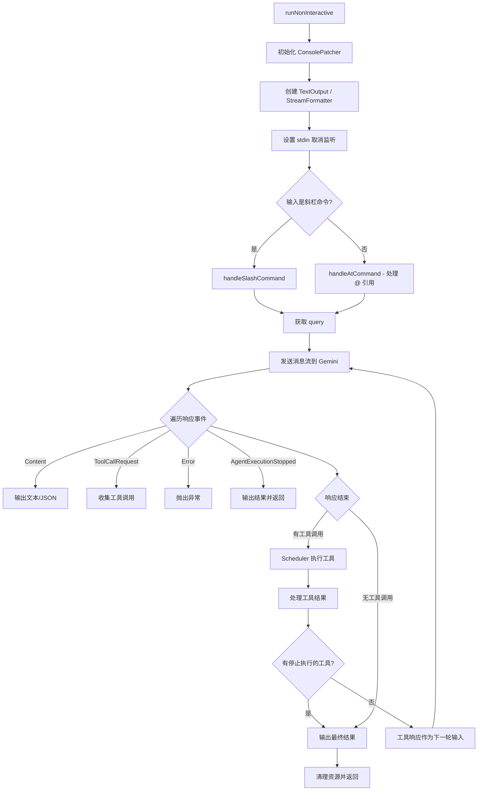

# nonInteractiveCli.ts

> 非交互式 CLI 执行引擎，处理单次用户输入并通过流式响应输出 Gemini 模型回复。

## 概述

`nonInteractiveCli.ts` 是 Gemini CLI 非交互模式（管道、脚本、CI/CD 等场景）的核心执行模块。它接收一次性用户输入，与 Gemini 模型进行多轮对话（包含工具调用循环），将响应以纯文本、JSON 或流式 JSON 格式输出到标准输出。同时支持 Ctrl+C 取消、斜杠命令处理、@命令扩展、EPIPE 优雅退出等特性。

## 架构图（mermaid）

## 主要导出

| 导出 | 类型 | 说明 |
|---|---|---|
| `runNonInteractive` | 异步函数 | 非交互式 CLI 的主执行函数 |

## 核心逻辑

### 输入处理

1. 在 `promptIdContext` 上下文中运行，绑定 `prompt_id`。
2. 若输入以 `/` 开头，委托 `handleSlashCommand` 处理斜杠命令。
3. 否则调用 `handleAtCommand` 处理 `@` 文件引用并生成查询 parts。
4. 若处理失败，抛出 `FatalInputError`。

### 响应循环（while loop）

- 多轮对话机制：通过 `while(true)` 循环支持模型-工具交互的多轮执行。
- **轮次限制**：通过 `config.getMaxSessionTurns()` 检查轮次上限。
- **事件类型处理**：
  - `GeminiEventType.Content`：文本内容 -> 根据输出格式写入 stdout（支持 ANSI 剥离或原始输出）。
  - `GeminiEventType.ToolCallRequest`：工具调用请求 -> 收集到队列。
  - `GeminiEventType.Error`：错误 -> 直接抛出。
  - `GeminiEventType.LoopDetected`：循环检测 -> 记录警告。
  - `GeminiEventType.AgentExecutionStopped`：Agent 被停止 -> 输出最终结果并返回。
  - `GeminiEventType.AgentExecutionBlocked`：Agent 被阻止 -> 输出警告。

### 工具调用

- 使用 `Scheduler` 调度工具执行，传入 `abortController.signal` 支持取消。
- 处理工具执行结果：记录错误、收集响应 parts。
- 使用 `recordToolCallInteractions` 记录工具调用元数据。
- 检查是否有工具请求 `STOP_EXECUTION`，有则立即结束。
- 否则将工具响应 parts 作为下一轮用户消息继续循环。

### 输出格式

| 格式 | 处理方式 |
|---|---|
| `TEXT` | 通过 `TextOutput` 实时写入 stdout |
| `JSON` | 累积响应文本，最终通过 `JsonFormatter.format()` 输出 |
| `STREAM_JSON` | 通过 `StreamJsonFormatter` 实时输出结构化事件流 |

### 取消机制

- 检测 TTY 环境下的 Ctrl+C 按键。
- 启用 raw mode 捕获单个按键事件。
- 按下 Ctrl+C 后调用 `abortController.abort()`，延迟 200ms 显示 "Cancelling..." 消息。
- 在 finally 块中恢复 stdin 状态。

## 内部依赖

| 模块 | 用途 |
|---|---|
| `./ui/utils/commandUtils.js` | `isSlashCommand` - 判断输入是否为斜杠命令 |
| `./nonInteractiveCliCommands.js` | `handleSlashCommand` - 处理斜杠命令 |
| `./ui/utils/ConsolePatcher.js` | `ConsolePatcher` - 拦截 console 输出 |
| `./ui/hooks/atCommandProcessor.js` | `handleAtCommand` - 处理 @ 文件引用 |
| `./utils/errors.js` | `handleError`、`handleToolError`、`handleCancellationError`、`handleMaxTurnsExceededError` |
| `./ui/utils/textOutput.js` | `TextOutput` - 文本输出工具 |
| `./config/settings.js` | `LoadedSettings` 类型 |

## 外部依赖

| 模块 | 用途 |
|---|---|
| `@google/gemini-cli-core` | 提供 `Config`、`GeminiEventType`、`FatalInputError`、`OutputFormat`、`JsonFormatter`、`StreamJsonFormatter`、`Scheduler`、`coreEvents`、`debugLogger` 等核心类型和工具 |
| `@google/genai` | 提供 `Content`、`Part` 类型 |
| `node:readline` | 用于监听键盘事件实现 Ctrl+C 取消 |
| `strip-ansi` | 剥离 ANSI 转义序列 |
