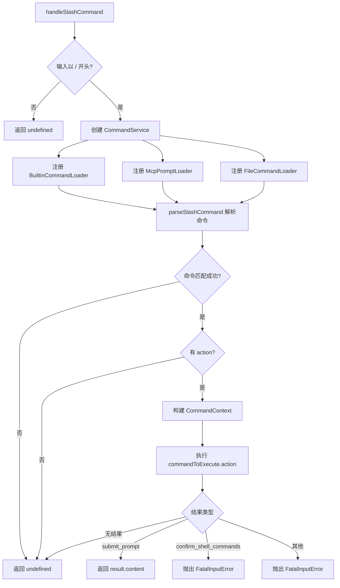

# nonInteractiveCliCommands.ts

> 在非交互式环境中解析并执行斜杠命令，将命令结果转换为可发送给模型的 prompt。

## 概述

`nonInteractiveCliCommands.ts` 负责在非交互式 CLI 模式下处理斜杠命令（如 `/command args`）。它创建 `CommandService` 实例并注册三类命令加载器（内置命令、MCP Prompt、文件命令），然后解析用户输入的斜杠命令并执行。若命令结果类型为 `submit_prompt`，将内容作为 prompt 返回给调用方；若结果需要用户确认等交互操作，则抛出 `FatalInputError`。

## 架构图（mermaid）

## 主要导出

| 导出 | 类型 | 说明 |
|---|---|---|
| `handleSlashCommand` | 异步函数 | 解析并执行斜杠命令，返回 `PartListUnion` 或 `undefined` |

## 核心逻辑

### 命令加载

通过 `CommandService.create()` 初始化命令服务，注册三类加载器：
- **`BuiltinCommandLoader`**：加载内置 CLI 命令
- **`McpPromptLoader`**：加载 MCP（Model Context Protocol）prompt 命令
- **`FileCommandLoader`**：加载基于文件的自定义命令

### 命令解析与执行

1. 使用 `parseSlashCommand(rawQuery, commands)` 解析输入，获取匹配的命令和参数。
2. 若命令有 `action` 方法，构建 `CommandContext`：
   - `services`：包含 `config`、`settings`、`logger`（无 git 服务）
   - `ui`：使用 `createNonInteractiveUI()` 创建非交互式 UI 适配器
   - `session`：包含会话统计信息和空的 shell 允许列表
   - `invocation`：包含原始输入、命令名和参数
3. 执行命令并处理结果：
   - `submit_prompt`：返回内容作为 Gemini 模型的输入
   - `confirm_shell_commands`：非交互模式不支持确认操作，抛出异常
   - 其他类型：非交互模式不支持，抛出异常

## 内部依赖

| 模块 | 用途 |
|---|---|
| `./utils/commands.js` | `parseSlashCommand` - 解析斜杠命令 |
| `./services/CommandService.js` | `CommandService` - 命令服务 |
| `./services/BuiltinCommandLoader.js` | 内置命令加载器 |
| `./services/FileCommandLoader.js` | 文件命令加载器 |
| `./services/McpPromptLoader.js` | MCP Prompt 加载器 |
| `./ui/commands/types.js` | `CommandContext` 类型 |
| `./ui/noninteractive/nonInteractiveUi.js` | `createNonInteractiveUI` - 非交互式 UI 工厂 |
| `./config/settings.js` | `LoadedSettings` 类型 |
| `./ui/contexts/SessionContext.js` | `SessionStatsState` 类型 |

## 外部依赖

| 模块 | 用途 |
|---|---|
| `@google/genai` | 提供 `PartListUnion` 类型 |
| `@google/gemini-cli-core` | 提供 `FatalInputError`、`Logger`、`uiTelemetryService`、`Config` |
