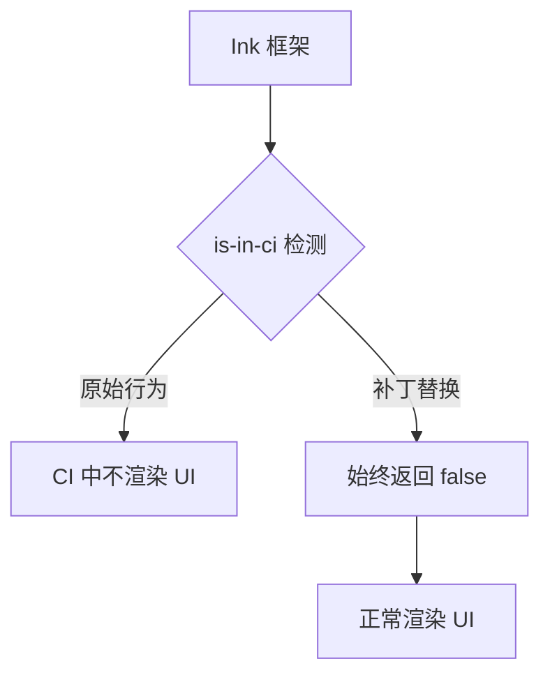

# patches 架构

> 第三方依赖的运行时补丁，修复与 Gemini CLI 运行环境不兼容的行为。

## 概述

`patches/` 目录包含对第三方依赖包的运行时补丁。当前唯一的补丁是替换 `is-in-ci` 包，该包被 Ink 框架内部使用。在 CI 环境中，Ink 会检测到 CI 并跳过 UI 渲染，但 Gemini CLI 的交互式模式在某些 CI 环境中仍需渲染 UI（如 Cloud Shell），因此需要强制覆盖此检测。

## 架构图



## 目录结构

```
patches/
└── is-in-ci.ts    # is-in-ci 包的替换实现
```

## 关键文件

| 文件 | 功能 |
|------|------|
| `is-in-ci.ts` | 将 `is-in-ci` 包替换为始终返回 `false` 的实现。这是安全的，因为 `is-in-ci`（通过 Ink）仅在 CLI 的交互式代码路径中使用。参见 issue #1563 |

## 内部依赖

无。此补丁通过构建系统的模块别名机制在打包时替换原始的 `is-in-ci` 包。

## 外部依赖

无直接依赖。补丁替换的是 `is-in-ci` npm 包的行为。
