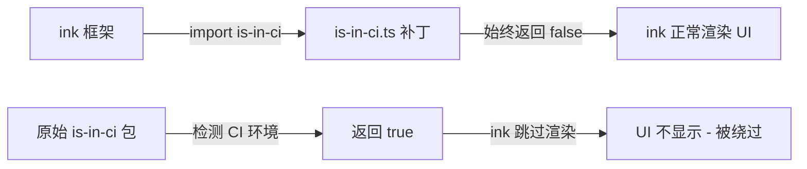

# is-in-ci.ts

> 替换第三方 `is-in-ci` 包的补丁模块，始终返回 `false` 以确保 `ink` 在 CI 环境中正常渲染 UI。

## 概述

`is-in-ci.ts` 是一个简单的补丁（patch）模块，用于替换 npm 包 `is-in-ci`。原始的 `is-in-ci` 包会检测当前进程是否运行在 CI 环境中，而 `ink`（React 终端 UI 框架）在检测到 CI 环境时会跳过 UI 渲染。此补丁模块通过始终返回 `false` 来绕过这一限制，确保 CLI 的交互式 UI 在 CI 环境中也能正常显示。

该补丁仅影响交互式代码路径（使用 `ink` 的部分），非交互式模式不依赖此模块。

相关 issue：#1563

## 架构图（mermaid）



## 主要导出

| 导出 | 类型 | 说明 |
|---|---|---|
| `default` (isInCi) | `boolean` | 常量 `false`，表示"不在 CI 环境中" |

## 核心逻辑

模块逻辑极其简单：

```typescript
const isInCi = false;
export default isInCi;
```

通过模块路径映射（通常在 `package.json` 的 `imports` 或构建工具配置中），将对 `is-in-ci` 的导入重定向到此补丁文件，从而覆盖原始包的行为。

## 内部依赖

无内部依赖。

## 外部依赖

无外部依赖。
