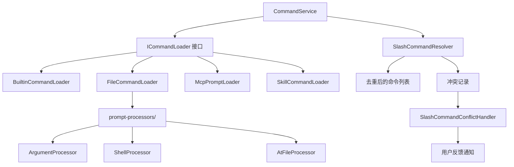

# services 架构

> 斜杠命令的发现、加载和冲突解决服务层，通过提供者模式聚合来自内置、文件、MCP 和技能的命令。

## 概述

`services/` 目录实现了 Gemini CLI 的斜杠命令服务层。它采用提供者模式（Provider Pattern），通过多个 `ICommandLoader` 实现从不同来源发现和加载斜杠命令（内置命令、TOML 文件命令、MCP prompt 命令、技能命令），然后使用 `SlashCommandResolver` 解决命名冲突，最终提供一个统一的命令列表。`SlashCommandConflictHandler` 负责向用户通知冲突信息。

## 架构图



## 目录结构

```
services/
├── types.ts                      # ICommandLoader 接口和 CommandConflict 类型
├── CommandService.ts             # 命令服务编排器
├── BuiltinCommandLoader.ts       # 内置命令加载器
├── FileCommandLoader.ts          # TOML 文件命令加载器
├── McpPromptLoader.ts            # MCP prompt 命令加载器
├── SkillCommandLoader.ts         # 技能命令加载器
├── SlashCommandResolver.ts       # 命令名冲突解决器
├── SlashCommandConflictHandler.ts # 冲突通知处理器
└── prompt-processors/            # Prompt 处理管道
```

## 关键文件

| 文件 | 功能 |
|------|------|
| `types.ts` | 定义 `ICommandLoader` 接口（loadCommands 方法）和 `CommandConflict` 类型 |
| `CommandService.ts` | `CommandService` 类 - 命令服务的核心编排器。通过异步工厂 `create()` 方法并行调用所有 loader，然后委托 `SlashCommandResolver` 解决冲突。提供 `getCommands()` 和 `getConflicts()` 访问器 |
| `BuiltinCommandLoader.ts` | `BuiltinCommandLoader` 类 - 加载 40+ 个内置斜杠命令（about、auth、bug、chat、clear、commands、compress、copy、docs、extensions、help、init、mcp、memory、model、plan、restore、settings、skills、tools 等）。根据 config 条件过滤命令（如 isAgentsEnabled、isPlanEnabled、getExtensionsEnabled） |
| `FileCommandLoader.ts` | `FileCommandLoader` 类 - 从 user/project/extension 目录递归扫描 `.toml` 文件，解析为可执行命令。支持 `{{args}}` 参数注入、`!{...}` shell 注入、`@{...}` 文件注入。加载顺序：用户 -> 项目 -> 扩展（按字母排序） |
| `McpPromptLoader.ts` | `McpPromptLoader` 类 - 从所有配置的 MCP 服务器获取 prompt，转换为斜杠命令。支持命名参数（`--key="value"`）和位置参数，提供 `help` 子命令和自动补全 |
| `SkillCommandLoader.ts` | `SkillCommandLoader` 类 - 将 SkillManager 中的技能转换为斜杠命令，命令执行时触发 `activate_skill` 工具 |
| `SlashCommandResolver.ts` | `SlashCommandResolver` 类 - 命名冲突解决器。规则：(1) 内置命令始终保留原名；(2) 非内置命令冲突时添加来源前缀（如 `extensionName.cmdName`）；(3) 多个非内置命令冲突时全部重命名 |
| `SlashCommandConflictHandler.ts` | `SlashCommandConflictHandler` 类 - 监听冲突事件，使用防抖批量合并通知，避免启动时的 UI 干扰 |

## 内部依赖

- `../ui/commands/types.ts` - `SlashCommand`、`CommandKind` 等类型定义
- `../ui/commands/*.ts` - 各内置命令的具体实现
- `prompt-processors/` - Prompt 处理管道组件
- `../utils/installationInfo.ts` - 开发模式检测

## 外部依赖

| 依赖 | 用途 |
|------|------|
| `@google/gemini-cli-core` | Config、coreEvents、isNightly、startupProfiler、getAdminErrorMessage 等 |
| `@iarna/toml` | TOML 文件解析 |
| `glob` | 文件模式匹配 |
| `zod` | TOML 命令定义的 Schema 验证 |
| `@modelcontextprotocol/sdk` | PromptArgument 类型 |
