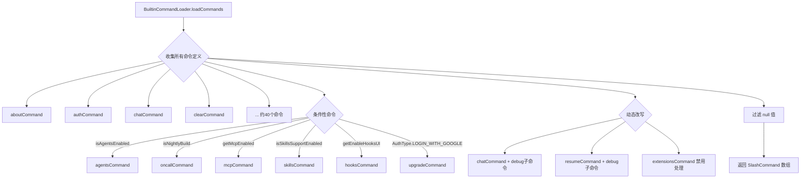

# BuiltinCommandLoader.ts

> 加载 Gemini CLI 中所有硬编码的内置斜杠命令。

## 概述

`BuiltinCommandLoader` 是 `ICommandLoader` 接口的实现之一，负责收集和组装所有作为应用核心组成部分的内置斜杠命令。它从约 40 个独立的命令定义模块中导入命令对象，根据运行时配置（如是否为 nightly 构建、是否启用 agents/MCP/skills/hooks 等功能开关）动态决定哪些命令可用，并对部分命令注入依赖（如 `config`）或进行条件性改写（如添加 debug 子命令）。

该加载器是命令系统中优先级最高的来源 -- 内置命令在冲突解析中永远保留原始名称。

## 架构图（mermaid）

## 主要导出

| 导出名称 | 类型 | 说明 |
|---|---|---|
| `BuiltinCommandLoader` | 类 | 实现 `ICommandLoader`，加载所有内置斜杠命令 |

## 核心逻辑

### 构造函数

接收 `Config | null` 参数，用于在加载过程中查询各种功能开关。

### `loadCommands(_signal: AbortSignal): Promise<SlashCommand[]>`

1. **启动性能追踪**：通过 `startupProfiler.start('load_builtin_commands')` 记录加载耗时。
2. **检测 Nightly 构建**：调用 `isNightly(process.cwd())` 判断当前是否为 nightly 版本。
3. **构建 debug 子命令注入器**：`addDebugToChatResumeSubCommands` 递归函数仅在 nightly 构建下向 `chatCommand` 和 `resumeCommand` 的子命令列表中追加 `debugCommand`。
4. **组装命令数组**：构建包含约 40 个命令的 `allDefinitions` 数组，其中：
   - 无条件命令（`aboutCommand`、`clearCommand`、`helpCommand` 等）直接加入。
   - 条件命令通过展开运算符 `...()` 配合三元表达式根据 `config` 的功能开关决定是否加入。
   - 被禁用的功能（如 MCP、extensions、skills）会替换为返回管理员错误消息的占位命令。
5. **过滤并返回**：过滤掉所有 `null` 值后返回最终命令数组。

### 关键条件分支

| 条件 | 启用时加载 | 禁用时行为 |
|---|---|---|
| `config.isAgentsEnabled()` | `agentsCommand` | 不加载 |
| `config.getMcpEnabled()` | `mcpCommand` | 加载错误占位命令 |
| `config.isSkillsSupportEnabled()` | `skillsCommand` | 不加载 |
| `config.getExtensionsEnabled()` | `extensionsCommand` | 加载错误占位命令 |
| `config.getEnableHooksUI()` | `hooksCommand` | 不加载 |
| `config.isPlanEnabled()` | `planCommand` | 不加载 |
| `config.getFolderTrust()` | `permissionsCommand` | 不加载 |
| `isNightly` | `oncallCommand` + debug 子命令 | 不加载 |
| `isDevelopment` | `profileCommand` | 不加载 |
| `AuthType.LOGIN_WITH_GOOGLE` | `upgradeCommand` | 不加载 |

## 内部依赖

| 模块 | 说明 |
|---|---|
| `./types.js` | `ICommandLoader` 接口 |
| `../utils/installationInfo.js` | `isDevelopment` 标志 |
| `../ui/commands/*.js` | 约 40 个独立命令定义模块 |

## 外部依赖

| 包名 | 说明 |
|---|---|
| `@google/gemini-cli-core` | `Config` 类型、`isNightly`、`startupProfiler`、`getAdminErrorMessage`、`AuthType` |
