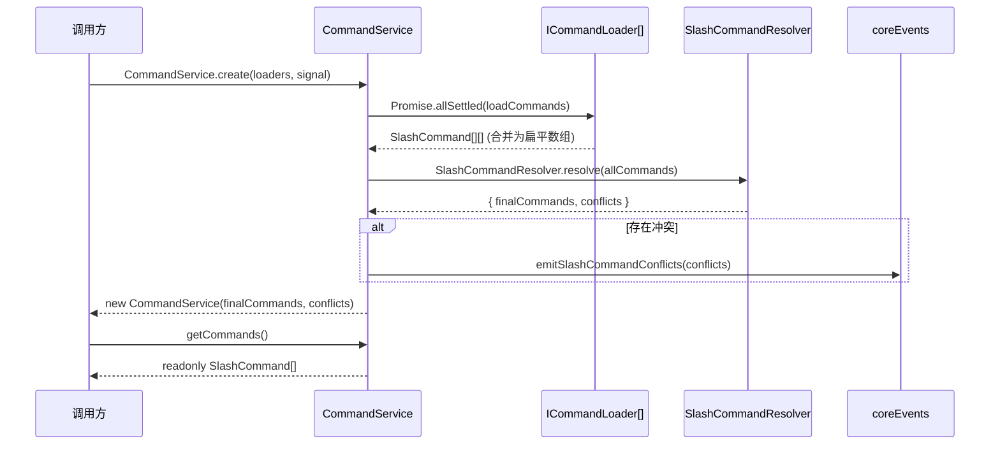

# CommandService.ts

> 编排所有命令加载器的发现与加载过程，并协调命令名称冲突解析的核心服务。

## 概述

`CommandService` 是 Gemini CLI 斜杠命令系统的中央编排器。它采用**基于提供者的加载器模式**，接受一组 `ICommandLoader` 实例，并行调用它们以从不同来源（内置代码、本地文件、MCP 服务器、Agent 技能）发现命令，然后委托 `SlashCommandResolver` 对命令名称冲突进行解析和去重。

该类使用**异步工厂模式**（私有构造函数 + 静态 `create` 方法），确保实例在创建时已完成所有异步初始化工作，对外提供只读的命令和冲突列表。

## 架构图（mermaid）

## 主要导出

| 导出名称 | 类型 | 说明 |
|---|---|---|
| `CommandService` | 类 | 命令发现与冲突解析的编排服务 |

## 核心逻辑

### `static async create(loaders, signal): Promise<CommandService>`

异步工厂方法，执行以下流程：

1. **并行加载**：调用 `loadAllCommands` 并行执行所有加载器。
2. **冲突解析**：将收集到的全部命令传递给 `SlashCommandResolver.resolve()` 进行去重和重命名。
3. **事件通知**：若存在冲突，调用 `emitConflictEvents` 发射遥测事件。
4. **冻结并返回**：使用 `Object.freeze` 冻结命令和冲突数组，创建不可变的 `CommandService` 实例。

### `private static async loadAllCommands(loaders, signal): Promise<SlashCommand[]>`

- 使用 `Promise.allSettled` 并行调用所有加载器，确保单个加载器失败不会影响其他加载器。
- 对于 `rejected` 的结果，通过 `debugLogger.debug` 记录错误信息。
- 将所有 `fulfilled` 结果的命令数组合并为一个扁平数组。

### `private static emitConflictEvents(conflicts): void`

- 将 `CommandConflict[]` 扁平映射为遥测载荷格式，包含原始名称、重命名结果、来源类型等信息。
- 通过 `coreEvents.emitSlashCommandConflicts` 发射事件，供 `SlashCommandConflictHandler` 等监听器处理。

### `getCommands(): readonly SlashCommand[]`

返回只读的命令列表，防止外部修改内部状态。

### `getConflicts(): readonly CommandConflict[]`

返回只读的冲突列表，用于 UI 展示或诊断。

## 内部依赖

| 模块 | 说明 |
|---|---|
| `./types.js` | `ICommandLoader`、`CommandConflict` 接口 |
| `./SlashCommandResolver.js` | 命令名称冲突解析器 |
| `../ui/commands/types.js` | `SlashCommand` 类型 |

## 外部依赖

| 包名 | 说明 |
|---|---|
| `@google/gemini-cli-core` | `debugLogger`（调试日志）、`coreEvents`（事件总线） |
