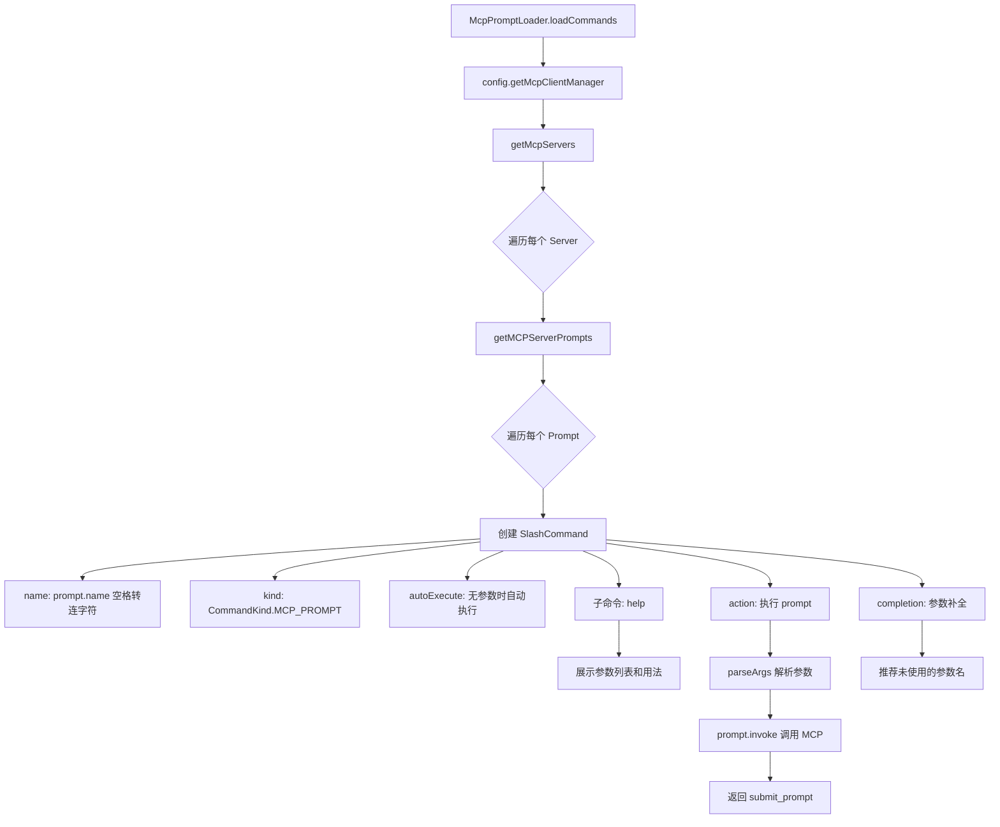

# McpPromptLoader.ts

> 从 MCP (Model Context Protocol) 服务器暴露的提示词中发现并加载斜杠命令。

## 概述

`McpPromptLoader` 是 `ICommandLoader` 接口的实现，负责将所有已配置 MCP 服务器上的 prompt 定义转换为可执行的斜杠命令。每个 MCP prompt 被适配为一个 `SlashCommand` 对象，自动生成 `help` 子命令用于展示参数信息，并提供智能参数补全功能。

该加载器支持两种参数传递方式：**命名参数**（`--argName="value"`）和**位置参数**（按顺序匹配必填参数），并内置了对缺失必填参数的校验和错误提示。

## 架构图（mermaid）

## 主要导出

| 导出名称 | 类型 | 说明 |
|---|---|---|
| `McpPromptLoader` | 类 | 从 MCP 服务器提示词加载斜杠命令的加载器 |

## 核心逻辑

### `loadCommands(_signal): Promise<SlashCommand[]>`

1. 通过 `config.getMcpClientManager().getMcpServers()` 获取所有 MCP 服务器配置。
2. 对每个服务器调用 `getMCPServerPrompts(config, serverName)` 获取其暴露的 prompt 列表。
3. 为每个 prompt 构建 `SlashCommand` 对象：
   - **名称**：`prompt.name` 中的空白字符替换为 `-`。
   - **自动执行**：仅在 prompt 无参数时设为 `true`。
   - **`mcpServerName`**：记录来源服务器名称，用于冲突解析时的命名空间前缀。

### `action` 闭包

1. 调用 `parseArgs` 解析用户输入的参数字符串。
2. 调用 `prompt.invoke(promptInputs)` 向 MCP 服务器发送请求。
3. 提取响应中的文本内容，封装为 `submit_prompt` 类型返回。
4. 错误情况返回 `message` 类型的错误信息。

### `parseArgs(userArgs, promptArgs): Record<string, unknown> | Error`

参数解析器，支持两种混合模式：

1. **命名参数**：正则 `--key="value"` 或 `--key=value`，支持引号内转义。
2. **位置参数**：未被命名参数消耗的文本，按引号分组或空格分隔提取。
3. **智能填充**：
   - 若仅有一个未填充的必填参数，将所有剩余位置参数合并为该参数值。
   - 若有多个未填充参数，按位置顺序依次匹配。
   - 若仍有未满足的必填参数，返回 `Error` 对象。

### `completion` 闭包

提供参数名自动补全：
- 过滤出尚未使用的参数名。
- 检测正在输入中的参数（末尾未闭合引号），自动补全闭合引号。
- 返回以 `--argName="` 格式的候选列表。

## 内部依赖

| 模块 | 说明 |
|---|---|
| `./types.js` | `ICommandLoader` 接口 |
| `../ui/commands/types.js` | `CommandKind`、`SlashCommand`、`CommandContext` 等类型 |

## 外部依赖

| 包名 | 说明 |
|---|---|
| `@google/gemini-cli-core` | `getErrorMessage`、`getMCPServerPrompts`、`Config` |
| `@modelcontextprotocol/sdk/types.js` | `PromptArgument` 类型（MCP SDK） |
