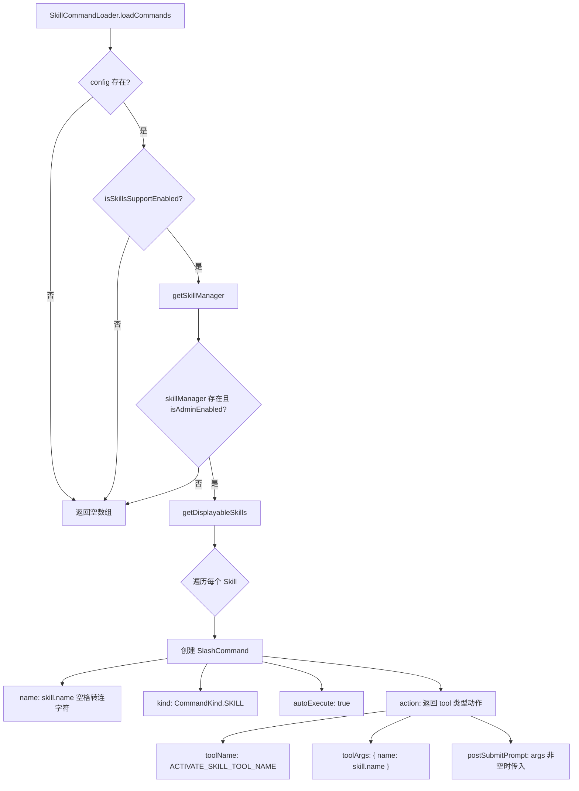

# SkillCommandLoader.ts

> 将 Agent Skills（智能体技能）转换为可执行的斜杠命令。

## 概述

`SkillCommandLoader` 是 `ICommandLoader` 接口的实现，负责从 `SkillManager` 中获取所有可展示的技能定义，并将它们适配为斜杠命令。每个技能命令在执行时不直接运行逻辑，而是返回一个 `tool` 类型的动作，指示系统调用 `ACTIVATE_SKILL_TOOL_NAME` 工具来激活相应技能。

该加载器是整个命令体系中最简洁的实现之一，因为技能的实际执行由工具层处理，加载器仅负责将技能元数据映射为命令接口。

## 架构图（mermaid）



## 主要导出

| 导出名称 | 类型 | 说明 |
|---|---|---|
| `SkillCommandLoader` | 类 | 从 SkillManager 加载技能为斜杠命令的加载器 |

## 核心逻辑

### `loadCommands(_signal): Promise<SlashCommand[]>`

1. **前置检查**（三重守卫）：
   - `config` 必须存在。
   - `config.isSkillsSupportEnabled()` 必须返回 `true`。
   - `config.getSkillManager()` 必须返回有效管理器，且 `isAdminEnabled()` 必须为 `true`。
2. **技能枚举**：调用 `skillManager.getDisplayableSkills()` 获取所有对用户可见的技能。
3. **映射为命令**：每个技能映射为一个 `SlashCommand`：
   - `name`: 技能名中的空白字符替换为 `-`。
   - `kind`: `CommandKind.SKILL`。
   - `autoExecute`: 始终为 `true`，表示选择即执行。
   - `action`: 返回 `{ type: 'tool', toolName, toolArgs, postSubmitPrompt }` 格式，由上层将其转化为工具调用。

### `action` 闭包

```typescript
action: async (_context, args) => ({
  type: 'tool',
  toolName: ACTIVATE_SKILL_TOOL_NAME,
  toolArgs: { name: skill.name },
  postSubmitPrompt: args.trim().length > 0 ? args.trim() : undefined,
})
```

- `type: 'tool'` 表示该命令不直接提交提示词，而是触发工具调用。
- `postSubmitPrompt`: 若用户在命令后附加了额外参数，将其作为技能激活后的后续提示词。

## 内部依赖

| 模块 | 说明 |
|---|---|
| `./types.js` | `ICommandLoader` 接口 |
| `../ui/commands/types.js` | `CommandKind`、`SlashCommand` 类型 |

## 外部依赖

| 包名 | 说明 |
|---|---|
| `@google/gemini-cli-core` | `Config` 类型、`ACTIVATE_SKILL_TOOL_NAME` 常量 |
