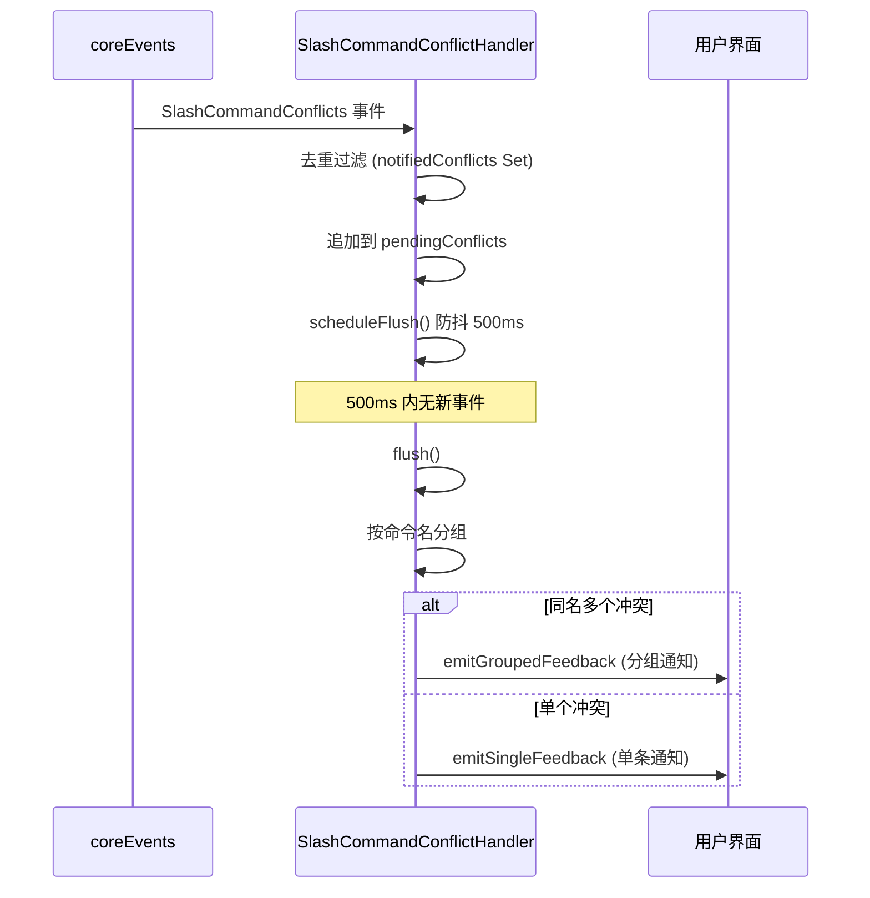

# SlashCommandConflictHandler.ts

> 监听斜杠命令冲突事件，批量聚合后向用户发送可读的通知消息。

## 概述

`SlashCommandConflictHandler` 是一个事件驱动的处理器，监听 `CoreEvent.SlashCommandConflicts` 事件，收集命令名称冲突信息，并以用户友好的格式输出通知。它采用**尾部防抖（trailing debounce）** 策略，将启动或增量加载过程中零散触发的冲突事件合并为一次批量通知，避免 UI 被大量冲突消息淹没。

该处理器还通过 `Set` 进行去重，确保同一冲突不会被重复通知。

## 架构图（mermaid）

## 主要导出

| 导出名称 | 类型 | 说明 |
|---|---|---|
| `SlashCommandConflictHandler` | 类 | 命令冲突事件的监听器和通知聚合器 |

## 核心逻辑

### 状态管理

| 属性 | 类型 | 说明 |
|---|---|---|
| `notifiedConflicts` | `Set<string>` | 已通知冲突的唯一键集合，用于去重 |
| `pendingConflicts` | `SlashCommandConflict[]` | 等待批量处理的冲突队列 |
| `flushTimeout` | `ReturnType<typeof setTimeout> | null` | 防抖定时器引用 |

### `start()` / `stop()`

- `start()`: 注册 `CoreEvent.SlashCommandConflicts` 事件监听器。
- `stop()`: 移除事件监听器并清理定时器。

### `handleConflicts(payload)`

1. **去重过滤**：为每个冲突生成唯一键 `name:sourceId:renamedTo`，其中 `sourceId` 优先取扩展名、MCP 服务器名或命令类型。
2. **追加队列**：将新冲突追加到 `pendingConflicts`。
3. **触发防抖**：调用 `scheduleFlush()` 重置 500ms 定时器。

### `flush()`

1. **取出队列**：清空 `pendingConflicts` 并获取快照。
2. **按名称分组**：使用 `Map<string, SlashCommandConflict[]>` 将冲突按原始命令名分组。
3. **分发通知**：
   - **多冲突分组**：调用 `emitGroupedFeedback` 生成多行列表消息。
   - **单冲突**：调用 `emitSingleFeedback` 生成含来源描述的完整句子。

### `getSourceDescription(extensionName?, kind?, mcpServerName?): string`

根据命令类型生成人类可读的来源描述：

| CommandKind | 输出示例 |
|---|---|
| `EXTENSION_FILE` | `extension 'myExt' command` |
| `MCP_PROMPT` | `MCP server 'myServer' command` |
| `USER_FILE` | `user command` |
| `WORKSPACE_FILE` | `workspace command` |
| `BUILT_IN` | `built-in command` |
| 其他 | `existing command` |

## 内部依赖

| 模块 | 说明 |
|---|---|
| `../ui/commands/types.js` | `CommandKind` 枚举 |

## 外部依赖

| 包名 | 说明 |
|---|---|
| `@google/gemini-cli-core` | `coreEvents`（事件总线）、`CoreEvent`（事件枚举）、`SlashCommandConflictsPayload` 和 `SlashCommandConflict` 类型 |
