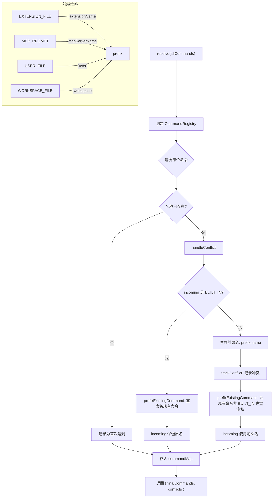

# SlashCommandResolver.ts

> 解析斜杠命令的名称冲突，确保所有命令具有唯一名称。

## 概述

`SlashCommandResolver` 是一个纯静态工具类，负责对来自不同来源的斜杠命令进行名称冲突解析。它实现了一套明确的优先级规则：

1. **内置命令（BUILT_IN）永远保留原始名称**，不会被重命名。
2. **非内置命令发生冲突时**，全部通过添加来源前缀进行重命名（如 `user.commandName`、`extensionName.commandName`）。
3. 若前缀后仍有冲突，自动追加数字后缀（`base1`、`base2`...）保证唯一性。

该解析器使用内部的 `CommandRegistry` 类管理解析状态，跟踪命令映射、首次遇到的命令和冲突记录。

## 架构图（mermaid）

## 主要导出

| 导出名称 | 类型 | 说明 |
|---|---|---|
| `SlashCommandResolver` | 类 | 命令名称冲突解析器（纯静态方法） |

## 核心逻辑

### 内部类 `CommandRegistry`

管理解析过程中的可变状态：

| 属性 | 类型 | 说明 |
|---|---|---|
| `commandMap` | `Map<string, SlashCommand>` | 最终名称到命令的映射 |
| `conflictsMap` | `Map<string, CommandConflict>` | 原始名称到冲突记录的映射 |
| `firstEncounters` | `Map<string, SlashCommand>` | 每个名称首次遇到的命令（用作冲突中的 "reason"） |

### `static resolve(allCommands): { finalCommands, conflicts }`

主入口方法：
1. 遍历所有命令，对每个命令检查是否已有同名命令。
2. 首次遇到的名称直接注册到 `firstEncounters` 和 `commandMap`。
3. 再次遇到同名命令时调用 `handleConflict` 解决冲突。
4. 返回去重后的命令列表和冲突记录。

### `private static handleConflict(incoming, registry): string`

冲突处理核心：
- **incoming 是 BUILT_IN**：内置命令抢占原名，现有占位者被强制重命名。
- **incoming 非 BUILT_IN**：incoming 生成前缀名被重命名；若现有占位者也非 BUILT_IN，同样被重命名。

### `private static prefixExistingCommand(name, reason, registry): void`

安全地重命名已占位的命令：
- 仅对非 BUILT_IN 命令生效。
- 从 `commandMap` 中移除旧名称条目，以新前缀名重新注册。
- 记录冲突事件。

### `private static getRenamedName(name, prefix, commandMap): string`

生成唯一的前缀名称：
- 基础名称：`prefix.name`（如 `user.deploy`、`myExtension.lint`）。
- 若基础名称已存在，追加数字后缀：`base1`、`base2`...

### `private static getPrefix(cmd): string | undefined`

根据命令类型返回前缀：

| CommandKind | 前缀 |
|---|---|
| `EXTENSION_FILE` | `cmd.extensionName`（扩展名称） |
| `MCP_PROMPT` | `cmd.mcpServerName`（MCP 服务器名） |
| `USER_FILE` | `'user'` |
| `WORKSPACE_FILE` | `'workspace'` |
| 其他 | `undefined` |

### `private static trackConflict(...)`

将冲突记录追加到 `conflictsMap`，按原始名称聚合多个 `losers`（被重命名的命令及其原因）。

## 内部依赖

| 模块 | 说明 |
|---|---|
| `./types.js` | `CommandConflict` 接口 |
| `../ui/commands/types.js` | `CommandKind` 枚举、`SlashCommand` 类型 |

## 外部依赖

无。
