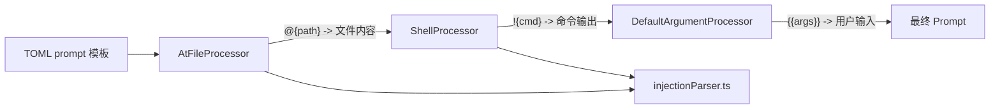

# services/prompt-processors 架构

> 自定义命令的 Prompt 处理管道，支持参数注入、Shell 命令执行和文件内容内联。

## 概述

`prompt-processors/` 目录实现了一个管道式的 Prompt 处理系统，用于在自定义 TOML 命令执行前对 prompt 模板进行变量替换和内容注入。处理器按安全优先级排列成管道，依次处理 `@{...}` 文件注入、`!{...}` Shell 命令注入和 `{{args}}` 参数注入。每个处理器实现 `IPromptProcessor` 接口，接收并返回 `PromptPipelineContent`（即 `PartUnion[]` 多模态内容数组）。

## 架构图



## 目录结构

```
prompt-processors/
├── types.ts               # 接口和常量定义
├── argumentProcessor.ts   # 默认参数处理器
├── shellProcessor.ts      # Shell 命令注入处理器
├── atFileProcessor.ts     # 文件内容注入处理器
└── injectionParser.ts     # 注入标记解析器
```

## 关键文件

| 文件 | 功能 |
|------|------|
| `types.ts` | 定义核心接口和常量：`IPromptProcessor`（process 方法）、`PromptPipelineContent`（`PartUnion[]`）、`SHORTHAND_ARGS_PLACEHOLDER`（`{{args}}`）、`SHELL_INJECTION_TRIGGER`（`!{`）、`AT_FILE_INJECTION_TRIGGER`（`@{`） |
| `argumentProcessor.ts` | `DefaultArgumentProcessor` 类 - 当 prompt 模板不包含 `{{args}}` 时，将用户的完整命令调用追加到 prompt 末尾，让模型自行解析参数 |
| `shellProcessor.ts` | `ShellProcessor` 类 - 处理 `!{...}` Shell 注入和 `{{args}}` 参数替换。`!{...}` 内的 `{{args}}` 会被 shell-escape 处理以防注入攻击。Shell 命令需要通过策略引擎授权。未授权时抛出 `ConfirmationRequiredError` 交由 UI 层处理确认 |
| `atFileProcessor.ts` | `AtFileProcessor` 类 - 处理 `@{path}` 文件内容注入。将占位符替换为指定文件的实际内容，支持多模态内容（文本和二进制） |
| `injectionParser.ts` | `extractInjections()` 函数 - 通用注入标记解析器，从文本中提取 `!{...}` 或 `@{...}` 标记的位置和内容，正确处理嵌套花括号 |

## 内部依赖

- `../../ui/commands/types.ts` - `CommandContext` 类型
- `../../ui/types.ts` - `MessageType` 类型
- `../../ui/themes/theme-manager.ts` - 主题管理器（ShellProcessor 用于输出格式化）

## 外部依赖

| 依赖 | 用途 |
|------|------|
| `@google/gemini-cli-core` | escapeShellArg、ShellExecutionService、flatMapTextParts、appendToLastTextPart、readPathFromWorkspace、PolicyDecision |
| `@google/genai` | PartUnion 类型 |
