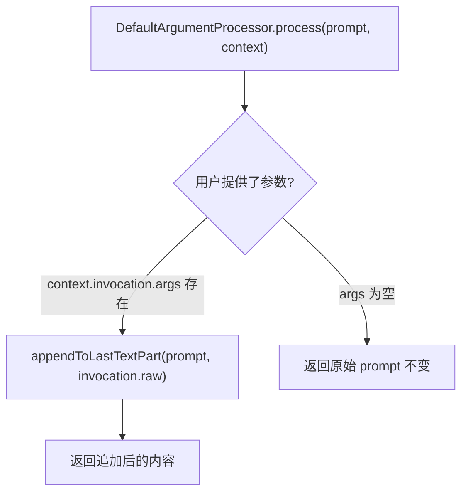

# argumentProcessor.ts

> 在提示词末尾追加用户原始命令输入的默认参数处理器。

## 概述

`DefaultArgumentProcessor` 是 `IPromptProcessor` 接口的最简实现，作为提示词处理管道的后备处理器。它仅在自定义命令的提示词模板**不包含** `{{args}}` 占位符时被使用。当用户在命令后附加了额外参数时，该处理器将完整的原始命令调用文本追加到提示词末尾，让模型自行解析和理解这些参数。

若用户未提供任何参数（`context.invocation.args` 为空），则提示词保持不变。

## 架构图（mermaid）



## 主要导出

| 导出名称 | 类型 | 说明 |
|---|---|---|
| `DefaultArgumentProcessor` | 类 | 实现 `IPromptProcessor`，在提示词末尾追加原始用户输入 |

## 核心逻辑

### `process(prompt, context): Promise<PromptPipelineContent>`

```typescript
async process(prompt, context) {
  if (context.invocation?.args) {
    return appendToLastTextPart(prompt, context.invocation.raw);
  }
  return prompt;
}
```

1. **条件判断**：检查 `context.invocation?.args` 是否为非空字符串。
2. **追加操作**：使用 `appendToLastTextPart` 工具函数将 `context.invocation.raw`（包含命令名称和参数的完整原始文本）追加到提示词内容的最后一个文本部分。
3. **无参数时**：直接返回原始 `prompt`，不做任何修改。

### 使用场景

当 TOML 命令定义文件中的 `prompt` 字段不包含 `{{args}}` 时，`FileCommandLoader` 会将此处理器注册为管道的最后一环。例如：

```toml
# 命令定义（无 {{args}}）
prompt = "请审查以下代码并提供改进建议："
```

用户输入 `/review main.py` 时，处理后的提示词变为：
```
请审查以下代码并提供改进建议：
/review main.py
```

## 内部依赖

| 模块 | 说明 |
|---|---|
| `./types.js` | `IPromptProcessor`、`PromptPipelineContent` 接口/类型 |
| `../../ui/commands/types.js` | `CommandContext` 类型（通过 `types.js` 间接引用） |

## 外部依赖

| 包名 | 说明 |
|---|---|
| `@google/gemini-cli-core` | `appendToLastTextPart` 工具函数，将文本追加到 `PartUnion[]` 的最后一个文本部分 |
