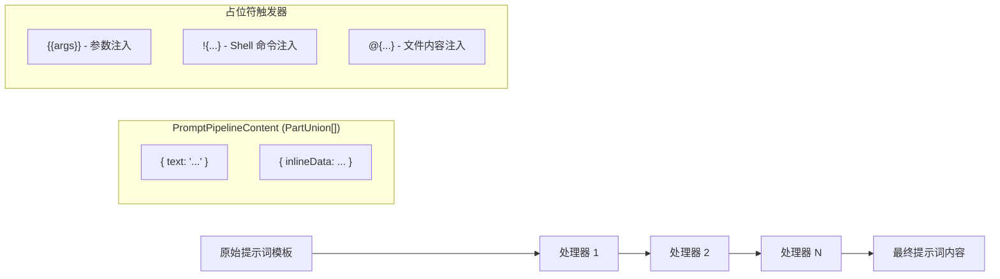

# types.ts

> 定义提示词处理管道的核心接口、类型和占位符常量。

## 概述

本文件是 `prompt-processors` 子模块的类型基础，定义了提示词处理管道的核心契约和配置常量。它包含三个关键部分：

1. **`PromptPipelineContent`** 类型 -- 管道的输入/输出数据格式，基于 `@google/genai` 的 `PartUnion[]`，支持多模态内容（文本、图片等）。
2. **`IPromptProcessor`** 接口 -- 管道中每个处理器必须实现的接口，采用经典的责任链模式。
3. **占位符常量** -- 定义了自定义命令模板中使用的三种注入触发器。

## 架构图（mermaid）



## 主要导出

| 导出名称 | 类型 | 说明 |
|---|---|---|
| `PromptPipelineContent` | 类型别名 | `PartUnion[]`，提示词管道的数据载体 |
| `IPromptProcessor` | 接口 | 提示词处理器契约，定义 `process` 方法 |
| `SHORTHAND_ARGS_PLACEHOLDER` | 常量 | `'{{args}}'`，参数注入占位符 |
| `SHELL_INJECTION_TRIGGER` | 常量 | `'!{'`，Shell 命令注入触发器 |
| `AT_FILE_INJECTION_TRIGGER` | 常量 | `'@{'`，文件内容注入触发器 |

## 核心逻辑

### `PromptPipelineContent`

```typescript
export type PromptPipelineContent = PartUnion[];
```

基于 Google GenAI SDK 的 `PartUnion` 数组类型，每个元素可以是 `{ text: string }` 或其他多模态部分（如内联数据、文件引用等）。这使得处理管道能够处理纯文本和多模态内容。

### `IPromptProcessor` 接口

```typescript
export interface IPromptProcessor {
  process(
    prompt: PromptPipelineContent,
    context: CommandContext,
  ): Promise<PromptPipelineContent>;
}
```

- `prompt`: 当前管道状态，可能已被前序处理器修改。
- `context`: 完整的命令上下文，提供对调用信息（`invocation.raw`、`invocation.args`）、应用服务和 UI 处理器的访问。
- 返回值: 变换后的内容，传递给下一个处理器或最终发送给模型。

### 占位符常量

| 常量 | 值 | 上下文行为 |
|---|---|---|
| `SHORTHAND_ARGS_PLACEHOLDER` | `{{args}}` | 在 `!{...}` 外部替换为原始参数；在 `!{...}` 内部替换为 shell 转义后的参数 |
| `SHELL_INJECTION_TRIGGER` | `!{` | 标识 shell 命令注入块的开始 |
| `AT_FILE_INJECTION_TRIGGER` | `@{` | 标识文件内容注入块的开始 |

## 内部依赖

| 模块 | 说明 |
|---|---|
| `../../ui/commands/types.js` | `CommandContext` 类型 |

## 外部依赖

| 包名 | 说明 |
|---|---|
| `@google/genai` | `PartUnion` 类型（GenAI SDK 的多模态内容单元） |
