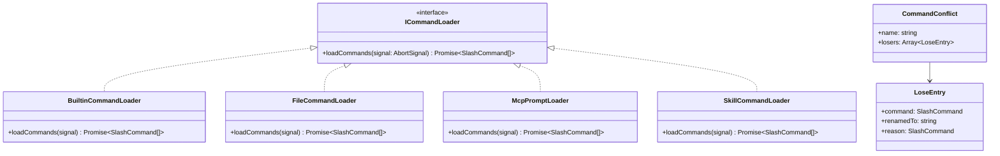

# types.ts

> 定义斜杠命令加载器接口和命令冲突数据结构的类型声明文件。

## 概述

本文件是 `services` 层的核心类型定义模块，为整个命令加载体系提供契约规范。它定义了两个关键类型：

1. **`ICommandLoader`** 接口 -- 所有命令加载器必须实现的统一接口，使 `CommandService` 能够以插件化方式扩展新的命令来源（如内置命令、文件命令、MCP 提示词、技能命令等），而无需修改核心编排逻辑。
2. **`CommandConflict`** 接口 -- 描述命令名称冲突时的数据结构，记录冲突命令的原始名称、被重命名后的名称、以及导致冲突的优先命令。

## 架构图（mermaid）

## 主要导出

| 导出名称 | 类型 | 说明 |
|---|---|---|
| `ICommandLoader` | 接口 | 命令加载器统一契约，要求实现 `loadCommands` 方法 |
| `CommandConflict` | 接口 | 描述命令名称冲突的元数据，包含冲突名称和被降级命令列表 |

## 核心逻辑

### `ICommandLoader` 接口

- 定义了唯一方法 `loadCommands(signal: AbortSignal): Promise<SlashCommand[]>`。
- `signal` 参数支持取消操作，使命令加载可以在应用关闭或超时时中断。
- 返回 `SlashCommand[]` 数组，加载器负责将其数据源（文件、API、内存等）转换为统一的命令对象。

### `CommandConflict` 接口

- `name`: 发生冲突的原始命令名称。
- `losers`: 被降级的命令数组，每个条目包含：
  - `command`: 原始的 `SlashCommand` 对象。
  - `renamedTo`: 重命名后的新名称（带来源前缀）。
  - `reason`: 导致该命令被重命名的优先命令。

## 内部依赖

| 模块 | 说明 |
|---|---|
| `../ui/commands/types.js` | 引入 `SlashCommand` 类型定义 |

## 外部依赖

无。
