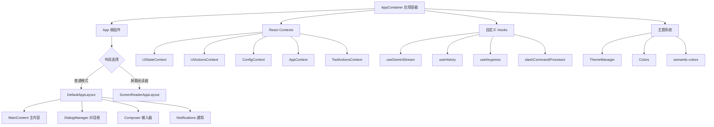

# ui 架构

> 基于 Ink (React) 的终端交互式 UI 系统，为 Gemini CLI 提供完整的终端界面体验

## 概述

`ui` 目录是 Gemini CLI 的前端交互层，使用 Ink 框架（基于 React 的终端 UI 库）构建。它负责渲染终端界面、处理用户输入、管理对话历史、与 Gemini API 交互，以及协调各种对话框和设置面板。整个 UI 系统采用 React 组件化架构，通过 Context 进行状态管理，通过自定义 Hooks 封装业务逻辑。

## 架构图



## 目录结构

```
ui/
├── App.tsx                 # 根组件，选择布局
├── AppContainer.tsx        # 应用容器，管理所有状态和 Context
├── IdeIntegrationNudge.tsx # IDE 集成提示组件
├── colors.ts               # 颜色代理对象，委托给主题管理器
├── semantic-colors.ts      # 语义化颜色代理对象
├── constants.ts            # UI 常量定义
├── textConstants.ts        # 文本常量（屏幕阅读器前缀等）
├── types.ts                # 核心类型定义（HistoryItem, AuthState 等）
├── debug.ts                # 调试状态追踪
├── auth/                   # 认证相关 UI
├── commands/               # 斜杠命令定义
├── components/             # UI 组件库
├── constants/              # 提示和加载短语
├── contexts/               # React Context 定义
├── editors/                # 编辑器设置管理
├── hooks/                  # 自定义 React Hooks
├── key/                    # 键盘绑定和匹配
├── layouts/                # 布局组件
├── noninteractive/         # 非交互模式支持
├── privacy/                # 隐私通知组件
├── state/                  # 状态管理（扩展更新）
├── themes/                 # 主题系统
└── utils/                  # UI 工具函数
```

## 关键文件

| 文件 | 功能 |
|------|------|
| `AppContainer.tsx` | 应用核心容器，初始化所有状态、Hooks、Context Provider，协调认证、主题、命令处理等 |
| `App.tsx` | 根组件，根据 UI 状态选择退出显示或正常布局（默认/屏幕阅读器） |
| `types.ts` | 定义 HistoryItem、AuthState、StreamingState、ToolCallStatus 等核心类型 |
| `colors.ts` | 颜色代理对象，通过 getter 委托给 ThemeManager 实现动态主题切换 |
| `semantic-colors.ts` | 语义化颜色代理，提供 text、background、border、ui、status 等语义分类 |
| `constants.ts` | 定义 Shell 相关常量、工具状态符号、超时时间、UI 尺寸阈值等 |
| `textConstants.ts` | 屏幕阅读器前缀、重定向警告等文本常量 |
| `debug.ts` | 追踪活跃动画组件数量，用于测试等待动画完成 |
| `IdeIntegrationNudge.tsx` | IDE 集成引导提示，询问用户是否连接编辑器 |

## 内部依赖

- `../config/` - 配置和设置管理（settings、auth、trustedFolders、extension-manager）
- `../core/initializer.ts` - 初始化结果类型
- `../utils/` - 通用工具函数（events、cleanup、processUtils、windowTitle、sessionUtils）

## 外部依赖

| 包名 | 用途 |
|------|------|
| `ink` | React 终端 UI 框架，提供 Box、Text 等组件及 useApp、useStdout 等 Hooks |
| `react` | UI 组件基础框架 |
| `@google/gemini-cli-core` | 核心业务逻辑（Config、AuthType、GeminiClient 等） |
| `ansi-escapes` | ANSI 转义序列工具（清屏等） |
