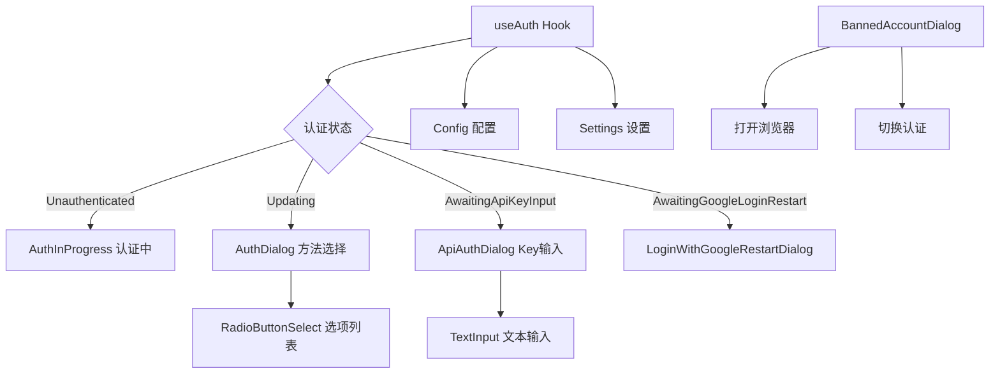

# auth 架构

> 认证 UI 模块，提供多种认证方式的交互界面和认证状态管理

## 概述

`auth` 目录包含 Gemini CLI 的认证相关 UI 组件和逻辑。它支持多种认证方式（Google 登录、Gemini API Key、Vertex AI、Cloud Shell），提供认证方法选择对话框、API Key 输入界面、认证进度显示、账号被封禁处理等功能。核心 Hook `useAuth` 管理整个认证状态机。

## 架构图



## 目录结构

```
auth/
├── useAuth.ts                      # 认证状态管理 Hook
├── AuthDialog.tsx                  # 认证方法选择对话框
├── ApiAuthDialog.tsx               # API Key 输入对话框
├── AuthInProgress.tsx              # 认证进行中的等待界面
├── LoginWithGoogleRestartDialog.tsx # Google 登录后重启提示
└── BannedAccountDialog.tsx         # 账号被封禁对话框
```

## 关键文件

| 文件 | 功能 |
|------|------|
| `useAuth.ts` | 核心认证 Hook，管理 AuthState 状态机，处理认证流程、错误、API Key 加载 |
| `AuthDialog.tsx` | 认证方法选择 UI，支持 Google 登录/Gemini API/Vertex AI/Cloud Shell |
| `ApiAuthDialog.tsx` | API Key 输入表单，支持粘贴、清除已存储的 Key |
| `AuthInProgress.tsx` | 认证等待中的 Spinner 界面，180 秒超时，支持 Esc/Ctrl+C 取消 |
| `LoginWithGoogleRestartDialog.tsx` | Google 登录成功后提示重启 CLI 以完成认证 |
| `BannedAccountDialog.tsx` | 账号被封禁时显示申诉链接、切换认证或退出选项 |

## 内部依赖

- `../components/shared/RadioButtonSelect` - 单选按钮组件
- `../components/shared/TextInput` - 文本输入组件
- `../components/shared/text-buffer` - 文本缓冲区
- `../components/CliSpinner` - CLI 加载动画
- `../hooks/useKeypress` - 键盘事件处理
- `../hooks/useKeyMatchers` - 键绑定匹配
- `../key/keyMatchers` - 命令匹配器
- `../semantic-colors` - 语义颜色
- `../types` - AuthState 枚举
- `../contexts/UIStateContext` - UI 状态上下文
- `../../config/auth` - 认证方法验证
- `../../config/settings` - 设置类型
- `../../utils/processUtils` - 进程重启工具
- `../../utils/cleanup` - 退出清理

## 外部依赖

| 包名 | 用途 |
|------|------|
| `ink` | Box、Text 组件 |
| `react` | useState、useEffect、useCallback、useRef |
| `@google/gemini-cli-core` | AuthType、Config、loadApiKey、clearApiKey、clearCachedCredentialFile |
