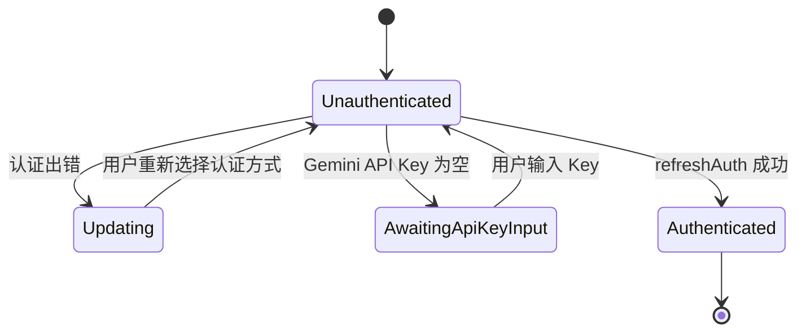
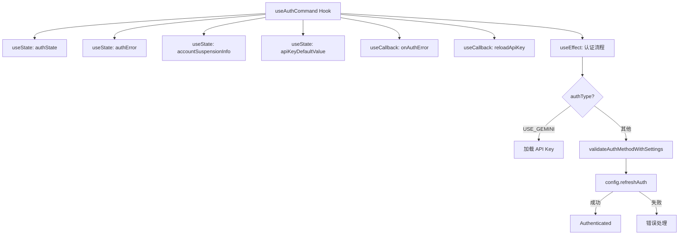

# useAuth.ts

> 提供认证状态管理的 React Hook 和认证方法验证工具函数

## 概述

`useAuth.ts` 是 Gemini CLI 认证子系统的核心模块，负责管理用户的认证生命周期。它导出一个验证函数 `validateAuthMethodWithSettings` 和一个 React Hook `useAuthCommand`，后者封装了完整的认证流程状态机，包括初始认证、API Key 输入等待、认证错误处理以及账户挂起检测。

## 架构图（mermaid）

## 主要导出

| 名称 | 类型 | 说明 |
|------|------|------|
| `validateAuthMethodWithSettings` | `function` | 验证认证方法是否符合设置中的强制类型要求 |
| `useAuthCommand` | `function (Hook)` | 管理认证状态机的 React Hook，返回完整的认证状态和控制函数 |

## 核心逻辑

1. **认证方法验证** (`validateAuthMethodWithSettings`)：
   - 检查设置中是否强制指定了认证类型（`enforcedType`），若不匹配则返回错误信息
   - 若启用了外部认证（`useExternal`），直接通过
   - Gemini API Key 类型不在此处验证（后续可能需要提示输入）
   - 其他类型委托给 `validateAuthMethod` 进行验证

2. **认证 Hook** (`useAuthCommand`)：
   - 通过 `useEffect` 监听 `authState` 变化，在 `Unauthenticated` 状态时启动认证流程
   - 对 `USE_GEMINI` 类型，先加载环境变量或存储的 API Key，若为空则切换到 `AwaitingApiKeyInput`
   - 调用 `config.refreshAuth(authType)` 执行实际认证
   - 捕获并区分处理账户挂起错误（`isAccountSuspendedError`）、项目 ID 缺失错误（`ProjectIdRequiredError`）和一般错误
   - `reloadApiKey` 优先读取 `GEMINI_API_KEY` 环境变量，其次读取本地存储

## 内部依赖

| 模块 | 用途 |
|------|------|
| `../types.js` → `AuthState` | 认证状态枚举 |
| `../../config/settings.js` → `LoadedSettings` | 已加载的设置类型 |
| `../../config/auth.js` → `validateAuthMethod` | 底层认证方法验证 |
| `../contexts/UIStateContext.js` → `AccountSuspensionInfo` | 账户挂起信息类型 |

## 外部依赖

| 模块 | 用途 |
|------|------|
| `react` | `useState`, `useEffect`, `useCallback` Hooks |
| `@google/gemini-cli-core` | `AuthType`, `Config`, `loadApiKey`, `debugLogger`, `isAccountSuspendedError`, `ProjectIdRequiredError`, `getErrorMessage` |
