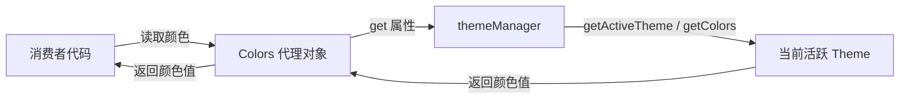

# colors.ts

> 通过懒加载代理模式提供动态主题颜色的全局访问入口

## 概述

`colors.ts` 导出一个 `Colors` 对象，该对象使用 JavaScript getter 代理模式，将所有颜色属性的读取委托给 `themeManager` 的当前活跃主题。这意味着每次读取颜色值时，都会动态获取当前主题的对应颜色，从而实现无需手动刷新的主题切换效果。

## 架构图（mermaid）

## 主要导出

| 名称 | 类型 | 说明 |
|------|------|------|
| `Colors` | `ColorsTheme` | 全局颜色代理对象，所有属性通过 getter 动态获取当前主题颜色 |

## 核心逻辑

- 所有颜色属性（`Foreground`、`AccentBlue`、`DiffAdded` 等）均通过 `get` 访问器实现
- 大部分属性直接从 `themeManager.getActiveTheme().colors` 读取
- `Background`、`DarkGray`、`InputBackground`、`MessageBackground` 四个属性从 `themeManager.getColors()` 读取（该方法会根据终端背景色动态计算混合色）

## 内部依赖

| 模块 | 用途 |
|------|------|
| `./themes/theme-manager.js` → `themeManager` | 主题管理器单例 |
| `./themes/theme.js` → `ColorsTheme` | 颜色主题类型定义 |

## 外部依赖

无
