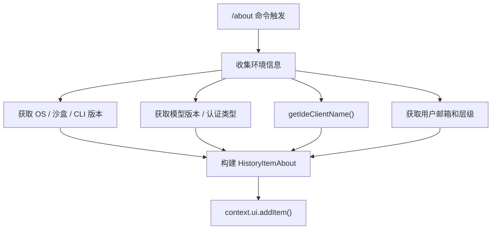

# aboutCommand.ts

> 显示 CLI 版本及运行环境信息

## 概述

`aboutCommand` 实现了 `/about` 斜杠命令，用于收集并展示当前 CLI 的版本号、操作系统、沙盒环境、模型版本、认证类型、GCP 项目、IDE 客户端信息、用户邮箱和用户层级等系统信息。

## 架构图（mermaid）

## 主要导出

| 导出名 | 类型 | 说明 |
|--------|------|------|
| `aboutCommand` | `SlashCommand` | `/about` 命令定义，自动执行，并发安全 |

## 核心逻辑

1. 从 `process.platform` 获取操作系统版本，从环境变量 `SANDBOX` 和 `SEATBELT_PROFILE` 判断沙盒类型。
2. 通过 `context.services.config.getModel()` 获取当前模型版本，`getVersion()` 获取 CLI 版本号。
3. 从 `UserAccountManager` 读取缓存的 Google 账户邮箱。
4. 调用内部辅助函数 `getIdeClientName()` 检测 IDE 集成模式并获取 IDE 名称。
5. 将所有信息打包为 `HistoryItemAbout` 对象添加到 UI 历史记录。

## 内部依赖

| 模块 | 用途 |
|------|------|
| `./types.js` | `CommandKind`、`CommandContext`、`SlashCommand` |
| `../types.js` | `MessageType`、`HistoryItemAbout` |

## 外部依赖

| 包 | 用途 |
|----|------|
| `node:process` | 获取平台和环境变量 |
| `@google/gemini-cli-core` | `IdeClient`、`UserAccountManager`、`debugLogger`、`getVersion` |
