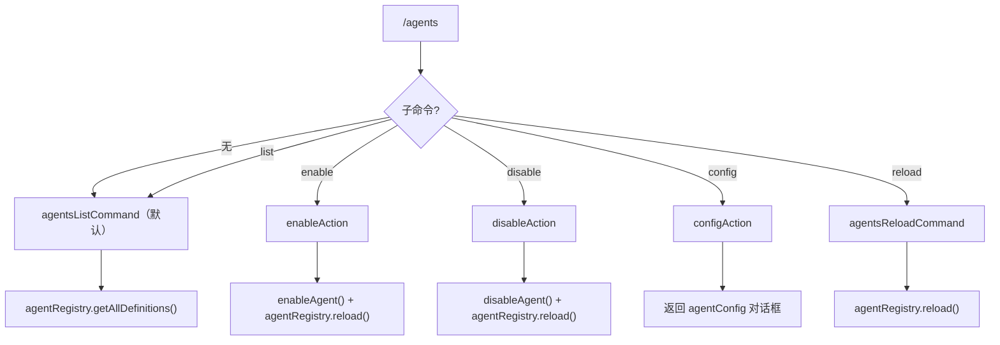

# agentsCommand.ts

> 管理代理（Agent）的列表、启用、禁用、配置和重载

## 概述

`agentsCommand` 实现了 `/agents` 斜杠命令及其子命令（`list`、`enable`、`disable`、`config`、`reload`），提供完整的代理生命周期管理功能。支持从代理注册表中获取所有代理定义，根据设置中的 `agents.overrides` 判断启用/禁用状态，并通过重新加载注册表使更改生效。

## 架构图（mermaid）

## 主要导出

| 导出名 | 类型 | 说明 |
|--------|------|------|
| `agentsCommand` | `SlashCommand` | `/agents` 顶层命令，默认执行 `list` 子命令 |

## 核心逻辑

1. **list**：从 `agentRegistry.getAllDefinitions()` 获取所有代理定义，映射为 `HistoryItemAgentsList` 并展示。
2. **enable**：校验代理名称是否存在且已禁用，调用 `enableAgent()` 更新设置，然后重载注册表。
3. **disable**：校验代理名称是否存在且已启用，根据是否存在工作区设置选择 `SettingScope`，调用 `disableAgent()` 后重载注册表。
4. **config**：获取代理的已发现定义，返回 `agentConfig` 对话框以进行配置。
5. **reload**：直接调用 `agentRegistry.reload()` 刷新所有代理。
6. 每个子命令都有对应的 `completion` 函数，基于代理名称前缀匹配提供自动补全。

## 内部依赖

| 模块 | 用途 |
|------|------|
| `./types.js` | `SlashCommand`、`CommandContext`、`SlashCommandActionReturn`、`CommandKind` |
| `../types.js` | `MessageType`、`HistoryItemAgentsList` |
| `../../config/settings.js` | `SettingScope` |
| `../../utils/agentSettings.js` | `disableAgent`、`enableAgent` |
| `../../utils/agentUtils.js` | `renderAgentActionFeedback` |

## 外部依赖

| 包 | 用途 |
|----|------|
| `@google/gemini-cli-core` | 无直接引用（通过 config 间接使用） |
