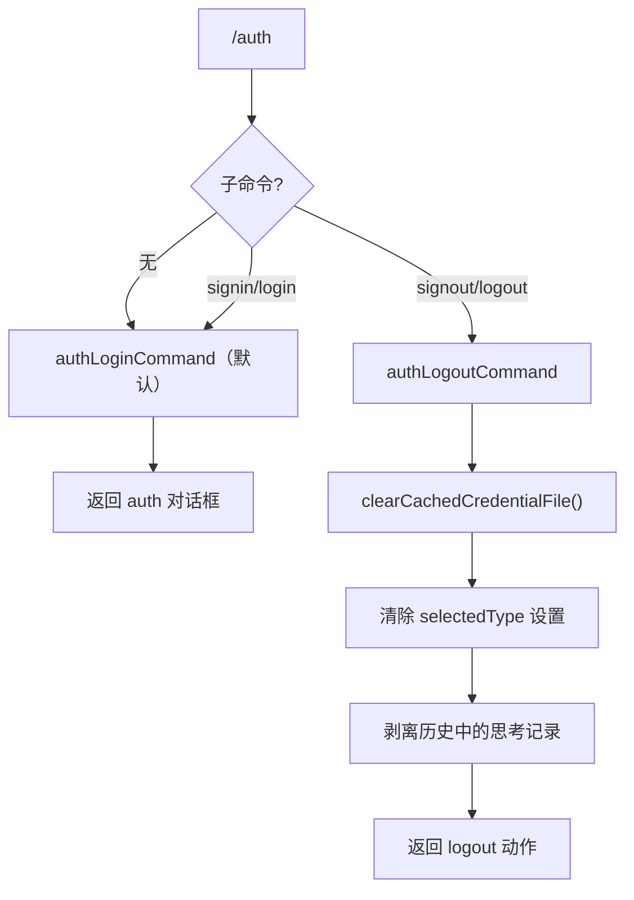

# authCommand.ts

> 管理身份认证（登录/登出）

## 概述

`authCommand` 实现了 `/auth` 斜杠命令及其两个子命令 `signin` 和 `signout`。`signin` 打开认证对话框供用户选择认证方式；`signout` 清除缓存的凭据文件，重置认证类型设置，并从历史中剥离思考记录。

## 架构图（mermaid）

## 主要导出

| 导出名 | 类型 | 说明 |
|--------|------|------|
| `authCommand` | `SlashCommand` | `/auth` 顶层命令，默认行为为登录 |

## 核心逻辑

1. **signin**（别名 `login`）：返回 `OpenDialogActionReturn`，触发 `auth` 对话框。
2. **signout**（别名 `logout`）：
   - 调用 `clearCachedCredentialFile()` 清除磁盘上的缓存凭据。
   - 通过 `settings.setValue()` 将 `security.auth.selectedType` 置为 `undefined`。
   - 调用 `stripThoughtsFromHistory()` 清除聊天历史中的模型思考内容。
   - 返回 `LogoutActionReturn` 信号，触发应用层的登出状态转换。

## 内部依赖

| 模块 | 用途 |
|------|------|
| `./types.js` | `OpenDialogActionReturn`、`SlashCommand`、`LogoutActionReturn`、`CommandKind` |
| `../../config/settings.js` | `SettingScope` |

## 外部依赖

| 包 | 用途 |
|----|------|
| `@google/gemini-cli-core` | `clearCachedCredentialFile` |
