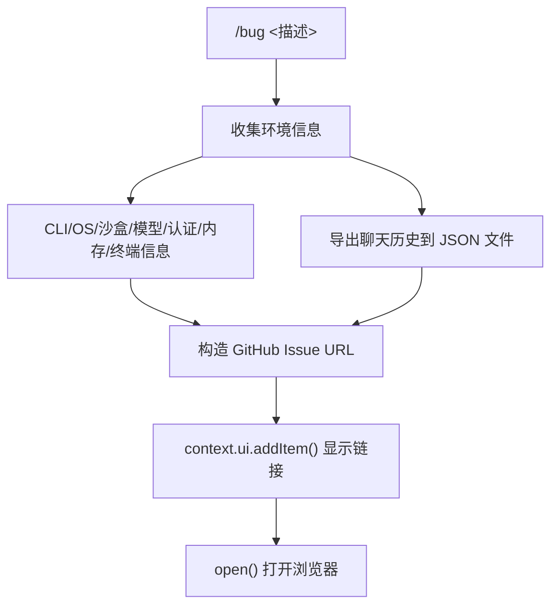

# bugCommand.ts

> 收集环境信息并提交 Bug 报告到 GitHub

## 概述

`bugCommand` 实现了 `/bug` 斜杠命令，自动收集 CLI 版本、Git 提交、操作系统、沙盒、模型、认证类型、内存使用、终端能力等环境信息，构造 GitHub Issue 预填充 URL，导出聊天历史到临时文件，并在浏览器中打开 Bug 报告页面。

## 架构图（mermaid）

## 主要导出

| 导出名 | 类型 | 说明 |
|--------|------|------|
| `bugCommand` | `SlashCommand` | `/bug` 命令，非自动执行（需要用户输入描述） |

## 核心逻辑

1. 从 `process`、`GIT_COMMIT_INFO`、`sessionId`、`getVersion()`、`terminalCapabilityManager` 等收集全面的环境信息。
2. 如果存在聊天历史（长度超过初始长度），导出历史到项目临时目录的 JSON 文件中，并提示用户附加到 Issue。
3. 支持通过 `config.getBugCommand().urlTemplate` 自定义 Bug 报告 URL 模板。
4. URL 中使用 `{title}`、`{info}`、`{problem}` 占位符进行 `encodeURIComponent` 替换。
5. 使用 `open` 包在浏览器中打开 URL，失败时在终端显示错误。

## 内部依赖

| 模块 | 用途 |
|------|------|
| `./types.js` | `CommandContext`、`SlashCommand`、`CommandKind` |
| `../types.js` | `MessageType` |
| `../../generated/git-commit.js` | `GIT_COMMIT_INFO` |
| `../utils/formatters.js` | `formatBytes` |
| `../utils/terminalCapabilityManager.js` | 终端名称、背景色、Kitty 协议检测 |
| `../utils/historyExportUtils.js` | `exportHistoryToFile` |

## 外部依赖

| 包 | 用途 |
|----|------|
| `open` | 打开浏览器 |
| `node:process` / `node:path` | 环境变量和路径操作 |
| `@google/gemini-cli-core` | `IdeClient`、`sessionId`、`getVersion`、`INITIAL_HISTORY_LENGTH`、`debugLogger` |
